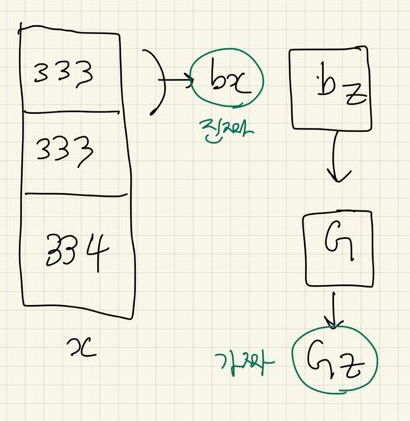

# GAN

</br>

* 1D 정규분포에서 샘플링한 데이터를 모방하여, fake data를 생성한다.</br>
  
* fake data는 정규분포의 특성을 갖는다. (KL divergence, 평균, 분산, 왜도, 첨도 등)</br>
  
* Discrimi의 loss는 max[log(Dx) + log(1 - DGz)]이고, Generator의 loss는 min[log(Dx + log(1 - DGz))]이다. </br>

  </br>

* Tensorflow에서는 이 loss 함수를 이용하여 직접 GAN을 학습할 수 있지만, </br>

  Keras에서는 model.fit(), model.train_on_batch() 함수에서 target 값을 지정해야 하기 때문에 이 loss로 GAN을 학습할 수 없다 **Keras는 기본적으로 Supervised learning 목적이다.**</br>

  * Keras에서는 supervised learning 방식으로 바꿔 binary_crossentropy loss 함수를 써서 GAN을 학습하는 것이 보통이다.</br>

    <br>

* 이 코드는 아래 자료를 참조해서 응용했다.</br>
  
  1. Rowel Atienza, 2018, Advanced Deep Learning with Keras. Chap 4. p.107 ~ p.113</br>
  2. 아마추어 퀀트, blog.naver.com/chunjein,  2020.04.08</br>
* 함수들의 기능을 파악하기 쉽도록 순서를 변경하였다.</br>

</br>

</br>

[TOC]

</br>

</br>

## Basic CODE

</br>

* Keras를 이용하여 기본 GAN 모델을 연습한다.</br>
* file: 딥러닝 8-2.GAN(Kears)</br>

</br>

#### step1. 정규분포로부터 데이터를 샘플링한다</br>

```python
realData = np.random.normal(size=1000)
realData = realData.reshape(realData.shape[0], 1)
```

</br>

#### step2. Network 빌드

```python
nDInput = realData.shape[1] # nDInput.shape[1] = 1
nDHidden = 32
nDOutput = 1
nGInput = 16
nGHidden = 32
nGOutput = nDInput

## nDInput와 nGOutput는 값이 같아야 함
```

</br>

```python
def getNoise(m, n=nGInput):
    z = np.random.uniform(-1., 1., size=[m, n])
    return z
```

```python
def MyOptimizer(a = 0.001):
    return RMSprop(lr = a)
```

</br>

#### step3. 모델 그림

```py
Generator --> Discriminator를 연결한 모델을 생성한다.
아래 네트워크로 z가 들어가면 DGz = 1이 나오도록 G를 학습한다.
D 네트워크는 업데이트하지 않고, G 네트워크만 업데이트한다.

        +---+   Gz   +---+
  z --->| G |------->| D |---> DGz
        +---+        +---+
      trainable   not trainable
```

</br>

</br>

#### step4. (객체지향) 함수 정의

**0. K.clear_session()</br>**

#####   1. Discriminator = BuildDiscriminator()</br>
#####   2. Generator = BuildGenerator()</br>
#####   3. GAN = BuildGAN(Discriminator, Generator)</br>

</br>

</br>

#### step5. 학습 세팅

```python
nBatchCnt = 3       # Mini-batch를 위해 input 데이터를 n개 블록으로 나눈다. # 333개, 333개, 334개로 쪼개짐 
nBatchSize = int(realData.shape[0] / nBatchCnt)  # 블록 당 Size # nBatchSize: 333개, 333개, 334개 순으로 들어감 
for epoch in range(1000):
    # Mini-batch 방식으로 학습한다
    for n in range(nBatchCnt):
        # input 데이터를 Mini-batch 크기에 맞게 자른다
        nFrom = n * nBatchSize #for문 다 돌면 nFrom= 666
        nTo = n * nBatchSize + nBatchSize #for문 다 돌면 nTo=1000
        
        # 마지막 루프이면 nTo는 input 데이터의 끝까지. 
        ## 왜 써주냐면 , n=2(마지막)일때 nTo = n * nBatchSize + nBatchSize는 999로 1000이 안되기 땜에.
        if n == nBatchCnt - 1:
            nTo = realData.shape[0]
```

</br>

``` python
        # 학습 데이터를 준비한다
        bx = realData[nFrom : nTo] #진짜 data 형성
        bz = getNoise(m=bx.shape[0], n=nGInput) # bx.shape[0]=333->333->334, nGInput=16
        Gz = Generator.predict(bz) #진짜 data shape 맞춰서 noise 써가지고 가짜 data 형성(fake data)
```



</br>

##### Discriminator = BuildDiscriminator()

```python

    	### < Discriminator를 학습한다. > ###
        # Real data가 들어가면 Discriminator의 출력이 '1'이 나오도록 학습하고,
        # Fake data (Gz)가 들어가면 Discriminator의 출력이 '0'이 나오도록 학습한다.
        """target data 만들기"""
        target = np.zeros(bx.shape[0] * 2)
        target[ : bx.shape[0]] = 0.9     # '1' 대신 0.9로 함
        target[bx.shape[0] : ] = 0.1     # '0' 대신 0.1로 함
        """target data 형성 완료"""
        
        bx_Gz = np.concatenate([bx, Gz]) # D 학습 
        Dloss = Discriminator.train_on_batch(bx_Gz, target) 
        #real data & fake data 모두가 D를 거치게 한다. 
        ##참고: fit 함수보다 train_on_batch 쓰는 게 더 속도가 빨라서 이거 씀
 
```


</br>

###### 	def BuildDiscriminator()

```python
# Discriminator를 G. D 각각 생성한다
def BuildDiscriminator():
    x = Input(batch_shape = (None, nDInput))
    h = Dense(nDHidden, activation = 'relu')(x)
    Dx = Dense(nDOutput, activation = 'sigmoid')(h) #0이면 가짜, 1이면 진짜로 하려고 sigmoid를 출력값으로 
    model = Model(x, Dx)
    model.compile(loss = 'binary_crossentropy', optimizer = MyOptimizer(0.001)) 
    #sigmoid 짝꿍 binary_crossentropy를 loss에 넣어서 1과 0 값이 출력되게 함 
    
    return model
```

</br>

</br>

##### GAN = BuildGAN(Discriminator, Generator)

```python
### < Generator를 학습한다. > ###
# Fake data (z --> Gz --> DGz)가 들어가도 Discriminator의 출력이 '1'이 나오도록 Generator를 학습한다.
"""target data 만들기"""
target = np.zeros(bx.shape[0])
target[:] = 0.9
"""target data 형성 완료"""
        
Gloss = GAN.train_on_batch(bz, target) 
## GAN 함수 참고: D는 위에서 학습해서 여기선 학습 안 하고 G만 학습 
# 어떤 학습? 가짜 data가 들어가면 target이 전부 1로 출력되도록(Discriminator가 전부 진짜로 판별하도록)! 
```


</br>

###### 	def BuildGAN(D, G)

``` python
def BuildGAN(D, G): # 전체 NETWORK Build 
    D.trainable = False     # Discriminator는 업데이트하지 않는다= 학습하지 않는다. 왜냐면 자체적으로 위에서 학습했으니까. 따라서 G만 학습됨 
    z = Input(batch_shape=(None, nGInput))
    Gz = G(z)
    DGz = D(Gz)
    
    model = Model(z, DGz) #z가 들어가면 최종적으로 DGz가 나온다. 
    model.compile(loss = 'binary_crossentropy', optimizer = MyOptimizer(0.0005)) # binary_crossentropy: 출력값이 0 아니면 1 나오도록
    return model
```

</br>

###### 	def BuildDiscriminator() = Discriminator

```python
# Discriminator를 G. D 각각 생성한다
def BuildDiscriminator():
    x = Input(batch_shape = (None, nDInput))
    h = Dense(nDHidden, activation = 'relu')(x)
    Dx = Dense(nDOutput, activation = 'sigmoid')(h) #0이면 가짜, 1이면 진짜로 하려고 sigmoid를 출력값으로 
    model = Model(x, Dx)
    model.compile(loss = 'binary_crossentropy', optimizer = MyOptimizer(0.001)) 
    #sigmoid 짝꿍 binary_crossentropy를 loss에 넣어서 1과 0 값이 출력되게 함 
    
    return model
```

</br>

###### 	def BuildGenerator() = Generator

```python
# Generator를 생성한다 
# G는 여기서 학습 안 하므로 '.complie' 안 함 
def BuildGenerator(): 
    z = Input(batch_shape = (None, nGInput))
    h = Dense(nGHidden, activation = 'relu')(z)
    Gz = Dense(nGOutput, activation='linear')(h)
    return Model(z, Gz)
```

</br>

##### kd = KL(ralData, fakeData)

```python
    if epoch % 10 == 0:
        z = getNoise(m=realData.shape[0], n=nGInput)
        fakeData = Generator.predict(z)  
        # Generator = BuildGenerator()에서 만든 Model(z, Gz)를 활용하여, 
        # "model.predict(z=노이즈 data)" 하라는 뜻 
        kd = KL(realData, fakeData)
        print("epoch = %d, D-Loss = %.3f, G-Loss = %.3f, KL divergence = %.3f" % (epoch, Dloss, Gloss, kd))
        # Dloss: 0.6932636 , Gloss: 0.6933405 , kd: 0.2189525518812676 = 분산이 적다
```

</br>

###### 	def KL

```python
# 두 분포 (P, Q)의 KL divergence를 계산한다.
def KL(P, Q):
    # 두 데이터의 분포를 계산한다
    histP, binsP = np.histogram(P, bins=100)
    histQ, binsQ = np.histogram(Q, bins=binsP)
    
    # 두 분포를 pdf로 만들기 위해 normalization한다.
    histP = histP / (np.sum(histP) + 1e-8)
    histQ = histQ / (np.sum(histQ) + 1e-8)

    # KL divergence를 계산한다
    kld = np.sum(histP * (np.log(histP + 1e-8) - np.log(histQ + 1e-8)))
    return kld
```

</br>

</br>

#### plt

```python
# real data 분포 (p)와 fake data 분포 (q)를 그려본다
z = getNoise(m=realData.shape[0], n=nGInput)
fakeData = Generator.predict(z)

plt.figure(figsize=(8, 5))
sns.set_style('whitegrid')
sns.kdeplot(realData[:, 0], color='blue', bw=0.3, label='Real')
sns.kdeplot(fakeData[:, 0], color='red', bw=0.3, label='Fake')
plt.legend()
plt.title('Distibution of real and fake data')
plt.show()
```


------

------

</br>

</br>

## CNN GAN (DCGAN) CODE

</br>

* 사용한 함수 총 5개:</br>

  1. def build_generator(inputs, image_size)</br>

  2. def build_discriminator(inputs)</br>

  3. def train(models, x_train, params)</br>

  4. def build_and_train_models(load_W = False, train_steps = 100)</br>

  5. def plot_images():</br>

</br>


</br>

</br>

#### Base

```python
# load MNIST dataset
(x_train, _), (_, _) = mnist.load_data()
""" 비지도 방법으로 사용 """

# reshape data for CNN as (28, 28, 1) and normalize 
""" 2D CNN """
image_size = x_train.shape[1] # x_train.shape (60000, 28, 28)
x_train = np.reshape(x_train, [-1, image_size, image_size, 1]) # x_train.shape = (60000, 28, 28, 1)
x_train = x_train.astype('float32') / 255 # 표준화

# the latent or z vector is 100-dim
latent_size = 100 #latent: KNN 가기 전 층들
```

</br>

</br>

#### step 1. build_generator

```python
def build_generator(inputs, image_size): # latent 층에 씀 
    image_resize = image_size // 4
    
    # network parameters 
    kernel_size = 5
    layer_filters = [128, 64, 32, 1]

    x = Dense(image_resize * image_resize * layer_filters[0])(inputs)
    x = Reshape((image_resize, image_resize, layer_filters[0]))(x)

    for filters in layer_filters: # hidden 층을 for문으로 써줌(쫙 쌓아주는 것)
        # first two convolution layers use strides = 2
        # the last two use strides = 1
        if filters > layer_filters[-2]:
            strides = 2 # 따라서 layer_filters의 뒤에서 2번째까진 strides = 2
        else:
            strides = 1
        x = BatchNormalization()(x)
        x = Activation('relu')(x)
        x = Conv2DTranspose(filters=filters,
                            kernel_size=kernel_size,
                            strides=strides,
                            padding='same')(x) # data 양 뿔려줌 

    x = Activation('sigmoid')(x)
    generator = Model(inputs, x, name='generator') # 모방 모델이므로 y 자리엔 x 학습 결과를 써줌 
    return generator # 요렇게 fake data 만들어서 전에 모델처럼 Discriminator에 넣어줌 
```

</br>

</br>

#### step 2. build_discriminator

```python
def build_discriminator(inputs):
    kernel_size = 5
    layer_filters = [32, 64, 128, 256]

    x = inputs
    for filters in layer_filters:
        # first 3 convolution layers use strides = 2
        # last one uses strides = 1
        # 따라서 Discriminator를 더 많이 학습하게 됨 
        if filters == layer_filters[-1]:
            strides = 1
        else:
            strides = 2
        x = LeakyReLU(alpha=0.2)(x)
        x = Conv2D(filters=filters,
                   kernel_size=kernel_size,
                   strides=strides,
                   padding='same')(x)

    x = Flatten()(x)
    x = Dense(1)(x)
    x = Activation('sigmoid')(x)
    discriminator = Model(inputs, x, name='discriminator')
    return discriminator
```

</br>

</br>

#### step 3. build_and_train_models

```python
def build_and_train_models(load_W = False, train_steps = 100):
    model_name = "dcgan_mnist"
    
    # network parameters
    batch_size = 64
    lr = 2e-4
    decay = 6e-8
    input_shape = (image_size, image_size, 1)

    # build discriminator model
    inputs = Input(shape=input_shape, name='discriminator_input')
    discriminator = build_discriminator(inputs)
    
    # [1] or original paper uses Adam, 
    # but discriminator converges easily with RMSprop
    optimizer = RMSprop(lr=lr, decay=decay)
    discriminator.compile(loss='binary_crossentropy',
                          optimizer=optimizer,
                          metrics=['accuracy'])
    discriminator.summary()
    
    # 저장된 discriminator 모델을 읽어온다.
    if load_W:
        discriminator.load_weights("dataset/dcgan_D.h5")

    # build generator model
    input_shape = (latent_size, )
    inputs = Input(shape=input_shape, name='z_input')
    generator = build_generator(inputs, image_size)
    generator.summary()

    # 저장된 generator 모델을 읽어온다.
    if load_W:
        generator.load_weights("dataset/dcgan_G.h5")
        
    # build adversarial model
    optimizer = RMSprop(lr=lr * 0.5, decay=decay * 0.5)
    
    # freeze the weights of discriminator during adversarial training
    discriminator.trainable = False
    
    # adversarial = generator + discriminator
    adversarial = Model(inputs, 
                        discriminator(generator(inputs)),
                        name=model_name)
    adversarial.compile(loss='binary_crossentropy',
                        optimizer=optimizer,
                        metrics=['accuracy'])
    adversarial.summary() #adversarial: 최종모델

    # train discriminator and adversarial networks
    models = (generator, discriminator, adversarial)
    params = (batch_size, latent_size, train_steps, model_name)
    train(models, x_train, params)
    
    # 모델을 저장해 둔다
    discriminator.save_weights("dataset/dcgan_D.h5")
    generator.save_weights("dataset/dcgan_G.h5")
```

</br>

</br>

#### step 4. train

```python
def train(models, x_train, params):
    # the GAN component models
    generator, discriminator, adversarial = models 
    
    
    # network parameters
    batch_size, latent_size, train_steps, model_name = params 
    
    
    # number of elements in train dataset
    train_size = x_train.shape[0]
    for i in range(train_steps):
        # train the discriminator for 1 batch
        # 1 batch of real (label=1.0) and fake images (label=0.0)
        # randomly pick real images from dataset
        rand_indexes = np.random.randint(0, train_size, size=batch_size)
        real_images = x_train[rand_indexes]
        
        # generate fake images from noise using generator 
        # generate noise using uniform distribution(모든 확률변수에 대해 균일한 확률을 가짐)
        noise = np.random.uniform(-1.0,
                                  1.0,
                                  size=[batch_size, latent_size])
        # generate fake images
        fake_images = generator.predict(noise)
        
        # real + fake images = 1 batch of train data
        x = np.concatenate((real_images, fake_images))
        
        # label real and fake images
        # real images label is 1.0
        y = np.ones([2 * batch_size, 1])
        
        # fake images label is 0.0
        y[batch_size:, :] = 0.0
        
        # train discriminator network, log the loss and accuracy
        loss, acc = discriminator.train_on_batch(x, y) 
        """Q. loss: 인덱스??? """
        log = "%d: [D-loss: %.4f, acc: %.4f]" % (i, loss, acc)

        # train the adversarial network for 1 batch
        # 1 batch of fake images with label=1.0
        # since the discriminator weights 
        # are frozen in adversarial network(adversarial network: 적대적 신경망(경쟁 속 반대편에 놓인 신경망))
        # only the generator is trained
        # generate noise using uniform distribution
        noise = np.random.uniform(-1.0,
                                  1.0, 
                                  size=[batch_size, latent_size])
        
        # label fake images as real or 1.0
        y = np.ones([batch_size, 1])
        # train the adversarial network 
        # note that unlike in discriminator training, 
        # we do not save the fake images in a variable
        # the fake images go to the discriminator input of the adversarial
        # for classification
        # log the loss and accuracy
        loss, acc = adversarial.train_on_batch(noise, y) 
        """Q. adversarial 뜻???"""
        log = "%s [G-loss: %.4f, acc: %.4f]" % (log, loss, acc)
        print(log)
   
    # save the model after training the generator
    # the trained generator can be reloaded for 
    # future MNIST digit generation
    generator.save(model_name + ".h5")

```

</br>

</br>

#### step 5. fake data를 화면에 표시

```python
# Generator가 생성한 이미지(fake data)를 화면에 표시한다.
def plot_images():
    inputs = Input(shape=(latent_size, ), name='z_input')
    generator = build_generator(inputs, image_size)
    generator.load_weights("dataset/dcgan_G.h5")
    
    noise_input = np.random.uniform(-1.0, 1.0, size=[16, latent_size])
    images = generator.predict(noise_input) # Generator 통해 나온 fake data
    plt.figure(figsize=(6, 6))
    num_images = images.shape[0]
    
    noise_input = np.random.uniform(-1.0, 1.0, size=[16, 100])
    rows = int(np.sqrt(noise_input.shape[0]))
    for i in range(num_images):
        plt.subplot(rows, rows, i + 1)
        image = np.reshape(images[i], [image _size, image_size]) 
        """why 3차원 reshape???"""
        plt.imshow(image, cmap='gray')
        plt.axis('off')
    plt.show()
```

</br>

</br>

#### Final

```python
# 이미 학습된 weights를 읽어오고, 추가로 학습한다.
build_and_train_models(load_W = True, train_steps = 10) # train_steps 만큼 반복 학습

# Generator가 생성한 이미지를 화면에 표시한다.
plot_images()
```

</br>

|                                                              |                                                              |
| ------------------------------------------------------------ | ------------------------------------------------------------ |
|  |  |

