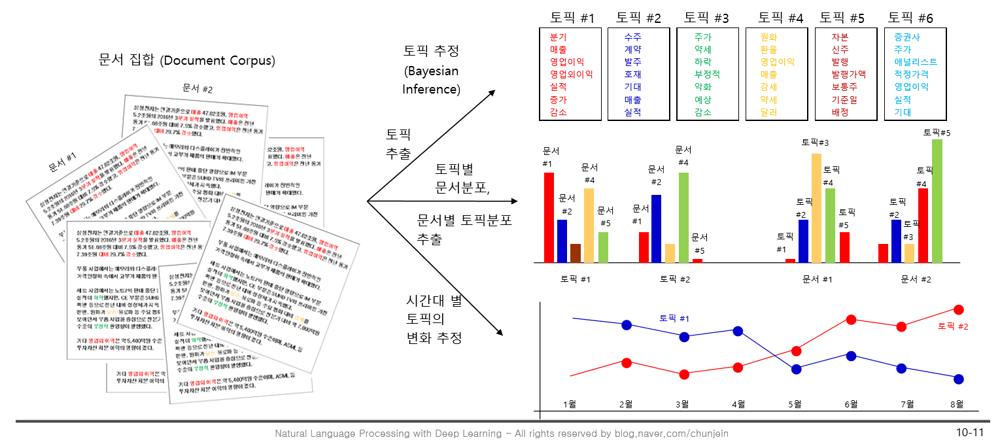

# 고급 NLP 레시피

* 유용한 블로그:

  * NLP 기초 용어 및 TF-IDF, BOW의 차이 등 아주 쉽게 정리해주심

    > hero4earth. 2018.01.17. "자연어(NLP) 처리 기초 정리". http://hero4earth.com/blog/learning/2018/01/17/NLP_Basics_01/

  * NLP 패키지 메소드 활용시 참고

    > 데이터사이언스스쿨. 2016.06.14. "Scikit-Learn의 문서 전처리 기능". https://datascienceschool.net/view-notebook/3e7aadbf88ed4f0d87a76f9ddc925d69/

  * 코사인 유사도:

    > 데이터 파수꾼 Baek Kyun Shin. 2020. 2. 17. "NLP - 8. 코사인 유사도(Cosine Similarity)". https://bkshin.tistory.com/entry/NLP-8-문서-유사도-측정-코사인-유사도
    >
    > 데이타광 DNA구너. 2020. 5. 20. "[스팀 2부 - 이론] 협업 필터링 - 스팀, 넷플릭스, 아마존이 당신을 사로잡기 위해 부리는 마법 이해하기". https://dnagooner.tistory.com/51

  * 토픽 모델:

    >  원준. "잠재 디리클레 할당(Latent Dirichlet Allocation, LDA)". https://wikidocs.net/30708


-----------------------------


## 자연어 관련 용어

- `Document`(문서)

- `Corpus`(말뭉치): 텍스트(문서)의 집합

- `Token`(토큰): 단어처럼 의미를 가지는 요소

- `Morphemes`(형태소): 의미를 가지는 언어에서 최소 단위

- `POS`(품사): ex) Nouns, Verbs

- `Stopword`(불용어): I, my, me, 조사, 접미사와 같이 자주 나타나지만 실제 의미에 큰 기여를 하지 못하는 단어들

- `Stemming`(어간 추출): 어간만 추출하는 것을 의미(running, runs, run -> run)

- `Lemmatization`(음소표기법): 앞뒤 문맥을 보고 단어를 식별하는 것

  > 출처: hero4earth. 2018.01.17. "자연어(NLP) 처리 기초 정리". http://hero4earth.com/blog/learning/2018/01/17/NLP_Basics_01/


-----------------


## 편집거리(Edit distance)

- 두 단어 간의 **형태적인 거리**

  - 의미적 거리 X
    - 의미적인 거리는 Word Embedding을 통해 구현

- 문자 교정, 추천단어에 사용

  - ex: 타자기에 appie를 쳤을 때, 기계 내에서 apple로 추천 단어를 보여주는 시스템

  - 이때 A와 B의 편집거리가 작은 순서로 추천을 해준다

    - 그렇다면, "A와 B 사이의 거리를 어떻게 측정할 것인가?"

      → Edit distance = Levenshtein distance


>  이하 코드는 크리슈나 바브샤 외 2. 자연어 처리 쿡북 with 파이썬. 에이콘. 2019.01.31에 기반을 두고 있다.


* 편집 거리를 계산하기 위해선,

  1. 자체 알고리즘 작성

  2. `nltk.metrics.distance.edit_distance()`와 비교하여 온전성 검사 수행

     ``` python
     from nltk.metrics.distance import edit_distance
     
     def my_edit_distance(str1, str2): #두 개의 문자열을 입력 받는다
         # 두 문자열의 길이를 구한다
         m = len(str1)+1 
         n = len(str2)+1
         
         # mXn을 할 테이블을 만들고 첫 번째 행과 열을 초기화한다.
         table = {}
         for i in range(m): table[i,0] = i
         for j in range(n): table[0,j] = j
             
         for i in range(1,m):
             for j in range(1,n):
                 cost = 0 if str1[i-1] == str2[j-1] else 1
                 table[i,j] = min(table[i, j-1]+1, table[i-1, j]+1, table[i-1, j-1]+cost)
         return table[i,j]
     
     
     print("Our Alorithm:", my_edit_distance("hand","and"))
     print("NLTK Alorithm:", edit_distance("hand","and"))
     
     ```

     > * print("Our Alorithm:", my_edit_distance("hand","and"))
     >
		>   Our Alorithm: 1
     >
     > * print("NLTK Alorithm:", edit_distance("hand","and"))
     >
     >   NLTK Alorithm: 1  

		> cost는 str1과 str2가 동일하거나 편집됐는지, 삭제 또는 삽입인지에 따라 계산됨
     >
     > 다음 행의 수식은 행렬에 있는 셀의 값을 계산하고 첫 번째 두 개는 대체를 처리하고 세 번째는 대체를 위한 것
     >
     	> 이전 단계의 비용을 추가하고 최소 세 단계를 취한다

  	|      | 0    | H         | A     | N    |
| ---- | ---- | --------- | ----- | ---- |
  | 0    | 0    | 1         | 2     | 3    |
| A    | 1    | **1**     | **1** | 3    |
  | N    | 2    | ==**2**== | **2** | 1    |
| D    | 3    | 3         | 3     | 2    |
  	ex: **AN(열)~H(행): 같게 만들기 위해** 1. A를 삭제 2. N→H 치환. 따라서 **2단계** 취해서 **2**
  	* action = 두 문자를 같게 만들기 위한 문자 1개를 1. 삭제 2. 치환 3. 삽입. 이때 최소 action의 개수를 table에 써줌
	
     
  
  3. 위에 굵은 글씨 (1,1/2,2) 설명하기 위해 따로 뺌
  
  |      | C1    | C2    |
  | ---- | ----- | ----- |
  | C1`  | ==A== | B     |
  | C2`  | C     | ==D== |
  
   * 알고리즘:
  
     * C2 == C2`
  
       → D = A
  
       따라서 이동할 필요 없다. cost = 0
  
       > cost = 0 if str1[i-1] == str2[j-1] else 1
  
       * C2 =/= C2`
  
         → A+1, B+1, C+1
  
         > table[i,j] = min(table[i, j-1]+1, table[i-1, j]+1, table[i-1, j-1]+cost)


### `TF-IDF`

* Text 문서를 수치로 표현할 때

  1. 단어의 빈도 기반(카운트 기반): `TF-IDF`
  2. `Embedding` 기반

* `TF-IDF` 용어: 
  
  * `TF`: 단어 빈도, term frequency
  * `DF`: 문서 빈도, document frequency
* `IDF`: DF값의 역수. 역문서 빈도, inverse document frequency
  
* TF-IDF 생성 순서

* 

  1. `Vocabulary` 생성
  2. Term - Document Matrix(`TDM`) 생성
     * Term : 행 / Document : 열
     * 행열 반전시킨 Document - Term Matrix(DTM) 으로도 가능
     * **Term이 각 Document에 몇 번 쓰였는지 카운트**
  3. Term Frequency(`TF`) 계산
     
     * TDM에서 **문서길이 표준화**
  4. `DF` 계산: **각 Vocabulary가 총 몇 개의 Document에 쓰였는지 카운트**
     * 이때, 검색문서는 카운트에서 제외하고
     * **단어가 쓰인 횟수가 아닌, Document 개수로 작성**
     * DF 大 ~ 여러 문서에 나타나는 General한 단어 → 중요도 小
     * 따라서 단어의 중요성 
       * =1/DF → 반비례 관계
       * =TF → 비례 관계
  5. Inverse DF(`IDF`) (즉, = 1/DF)  계산
     * DF에 log 취해서 계산
   * **단어의 중요도는 IF에 비례, IDF에 비례**
  
6. TF*IDF = `TF-IDF`
  
7. TF-IDF 상의 검색문 Vector와 Document Vector 값을 
  
     1. **norm**(l1,l2 등) 
        * l1: 벡터의 요소에 대한 절댓값의 합
        * l2: 해당 차원의 좌표평면에서 원점에서 벡터 좌표까지의 최단거리
     2. 검색문과 각 Document의 **내적 **
   3. **cosin 거리 **
  
     등으로 **유사도 측정**


* ## code

* sklearn 패키지 활용
  * 대표적인 Python 머신러닝 라이브러리에서는 문서 전처리용 클래스를 제공한다.
  * 기능
    - `DicVectorizer` : 단어의 수를 세어놓은 사전에서 BOW 벡터를 만든다.
    - `CountVectorizer`: 문서 집합으로부터 단어의 수를 세어 BOW 벡터를 만든다.
    - `Tfidfvectorizer`: 문서 집합으로부터 단어의 수를 세고 TF-IDF 방식으로 단어의 가중치를 조정한 BOW 벡터를 만든다.(CounterVectorizer의 서브클래스로 CountVectorizer를 이용해 BOW를 만들고 TfidTransformer를 사용해 tf-idf로 변환)
    - `HashingVectorizer`: hashing trick을 사용하여 빠르게 BOW 벡터를 만든다.

```python
from sklearn.feature_extraction.text import TfidfVectorizer
```


* TF-IDF matrix를 생성한다
  * 아래 Code 中 `tfidf_vect_simple.fit_transform(statements)` 참고

``` python
statements = [문장1, 문장2, 문장3]
TfidfVectorizer(max_features = 500) # 빈도 높은 순으로 500개 단어만 # 변환된 행렬은 희소 행렬
words = tfidf_vect_simple.fit_transform(statements) # 각 문서들에 대한 단어들이 나오는 빈도수를 log 처리 시켜서 table로 만듦(행렬로 만듦) # transform 써서 단어가 feature(열)로 바뀜 

vocab = tf_vector.get_feature_names() # shape=(500,) 단어 500개.
```


* cosin 분석한다

```python
from sklearn.metrics.pairwise import cosine_similarity
cosine_similarity(words,words) # tf-idf 처리된 행렬로 word 전체의 cosin-distance 구함
```


### `코사인 유사도`(거리)

* 벡터와 벡터 간의 유사도를 두 벡터 간의 각도로 나타낸 것
  * 각도=**방향**인 셈.
> 1. 방향이 비슷할수록 두 벡터는 서로 유사하며, 
> 2. 벡터 방향이 90도 일때는 두 벡터 간의 관련성이 없으며, 
> 3. 벡터 방향이 반대가 될수록 두 벡터는 반대 관계


>  그림 출처: 딥 러닝을 이용한 자연어 처리 입문


* 유클리디안 거리와 달리, cosin distance(유사도)는 방향만 고려하기 때문에 개인 맞춤 추천 솔루션(협업 필터링)에 활용된다.
  * 협업 필터링 기법에서는 한 '제품' 을 하나의 벡터로 취급한다.
    * 세부 특징 하나하나가 벡터가 되지 않는단 것이다


* > 출처 및 참고:
  >
  > * 데이터 파수꾼 Baek Kyun Shin. 2020. 2. 17. "NLP - 8. 코사인 유사도(Cosine Similarity)". https://bkshin.tistory.com/entry/NLP-8-문서-유사도-측정-코사인-유사도
  > * 데이타광 DNA구너. 2020. 5. 20. "[스팀 2부 - 이론] 협업 필터링 - 스팀, 넷플릭스, 아마존이 당신을 사로잡기 위해 부리는 마법 이해하기". https://dnagooner.tistory.com/51


-------------


* ### Text를 수치 Vector로 표현할 때

1. 통계적 기반, 빈도 기반, 카운트 기반:

   * `TF-IDF`: 

     1. Vocabulary(Dictionary) 생성
     2. Term - Document Matrix(`TDM`) 생성
     3. Term Frequency(`TF`) 계산
     4. `DF` 작성: **각 Vocabulary가 총 몇 개의 Document에 쓰였는지 카운트**
     5. Inverse DF(`IDF`) (즉, = 1/DF) 작성
     6. TF*IDF = `TF-IDF`
        + 나아가, TF-IDF 상의 검색문 Vector와 Document Vector 값을 가공하여 유사도 측정

   * **`BOW(Bag of word)`**: 

     * 쿡북 p. 235~

     * 방법: 수치로 형상화하여 추출 시 사용 

     * `doc2bow` 생성

       ex: I love you very much, you love me too.

       1. Vocabulary(Dictionary) 생성

          > 여러 문서로 부터 생성함
          >
          > I : 0
          >
          > love : 1
          >
          > you : 2
          
           >...(이하 생략)
          
       2. 문서를 doc2bow로 생성

          > 1. bow: 워드를 수치화(I love you~를 Vocabulary에서 정의한 숫자로 적어줌)
          >
          >    [0, 1, 2, ... 2, 1, ...] ← vector
          >
          > 2. Doc2Bow: 수치화된 워드별 빈도
          >
          >    [(0,1), (1,2), (2,2), ...] ← vector

           >   (0,1)에서 '1' = 빈도 

       3. LDA 모형 사용 

          1. 문서별 Topic 번호 확인
          2. topic별 문서 확인 

   * ==`TF-IDF`와 `BOW`의 차이점==:

     * Vocabulary 만들고 시작하는 건 같지만, 

       * 1. BOW는 TF까지, TF-IDF는 IDF와 TF*IDF까지 구함
         2. BOW의 TF와 TF-IDF의 TF값은 다름
            
            * 이유: TF-IDF의 TF는 표준화 시킨 값이고, BOW의 TF는 빈도만 세었기 때문
            
              > TF-IDF:
              >
              > **어떤 단어가 하나의 문서에서도 많이 사용되었다고 하더라도, 다른 모든 문서에서 널리 쓰이는 흔해 빠진 단어라면 이 단어는 특정성(specificity)이 떨어지는 것이다.**
              >
              > 그래서 단순 단어 빈도로 접근하는 게 아니라, 어떤 단어가 한 문서에서 많이 나타난 동시에 다른 문서에서는 잘 나타나지 않는 것까지 고려하기 위한 개념이 등장하는 데 이게 바로 **TF-IDF(Term Frequency-Inverse Document Frequency)**다. 
              >
              > 아무튼 TF-IDF는 단순한 단어 빈도가 아니라 일종의 가중치를 적용한 개념이라고 이해하면 된다. 그래서 이 TF-IDF를 활용해서 문서-단어 행렬을 만들고 분석을 하는 경우도 매우 많다.
              >
              > 그래서 파이썬 라이브러리 scikit-learn에서는 아예 단순 빈도로 접근하는 `CountVectorizer`말고, TF-IDF로 접근하는 `TfidfVectorizer `클래스를 제공하기도 한다.
              >
              > * 출처: 아무튼워라밸. 2020.01.24. "Bag-of-Words(BoW) 쉽게 이해하기". http://hleecaster.com/nlp-bag-of-words-concept/

         * 따라서 BOW와 TF-IDF의 쓰임새는 상황에 따라 다르다.

     * `BOW`: 주어진 말뭉치에서 사용된 각각의 단어의 빈도를 센다

       > 주어진 말뭉치에서 사용된 각각의 단어에 인덱스를 매겨서 사전처럼 만든다. (==Vocabulary==)
       >
       > 그리고 입력된 문서의 각 단어가 해당 단어 사전(단어 주머니)에서 해당 인덱스에 얼마나 나타나는지 표시하는 방식으로 입력된 문장을 분석한다. (==TF==)
     * `TF-IDF`: `BOW`와 같이 각각의 문서에서 단어의 개수를 세는 것은 같다. 그치만 여기에 전체 말뭉치(Corpus)에서 단어의 갯수도 함께 센다.

       > 특정 단어가 문서 내에 얼마나 자주 등장하는 지를 나타내는 ==TF(단어 빈도)==와
       >
       > 어떤 단어가 문서 전체 집합에서 얼마나 많이 나오는지를 나타내는 ==IDF(역문서 빈도)==로 
       >
       > 이 둘의 곱으로 TF-IDF를 값을 구할 수 있다.

2. Embedding 기반

   * Word Embedding: 벡터화


### 	`Bow`

* code에 `TF-IDF` 없음

* 한계: 

  > Bow 모델은 그 빈도만 세기 때문에 맥락을 충분히 고려해야 하는 상황, 즉 **텍스트를 생성한다거나 예측하는 등의 장면에는 활용이 어렵다.**
  >
  > 게다가 학습된 단어 사전을 기반으로 하기 때문에 사전에 없는 새로운 단어가 나타났을 때 그걸 처리할 방법이 없다. 학습 데이터에 지나치게 의존하기 때문에 **오버피팅(overfitting)**이 발생하는 거다.
  >
  > 출처: 아무튼워라밸. 2020.01.24. "Bag-of-Words(BoW) 쉽게 이해하기". http://hleecaster.com/nlp-bag-of-words-concept/

  

* ## Code:

  * `gensim` 패키지 활용
    * **문서 사이의 유사도 계산과 텍스트 분석을 돕는** 라이브러리
    * 기능
      - **Topic Modeling**
        - `LDA(Latent Dirichlet Allocation)`
        - LSI(Latent Semantic Indexing)
        - HDP(Hierarchical Dirichlet Process)
      - **Word Embedding**
        - `word2Vec`
    * Latent Dirichlet Allocation (`LDA`) using `gensim`
  

```python
import numpy as np
import re
import pickle
from nltk.corpus import stopwords
**from gensim import corpora**
**from gensim.models.ldamodel import LdaModel as LDA**
```


```python
# 1. 저장된 news data를 읽어온다.
# 2. 첫 번째 news를 조회해 본다.
# 3. news 별로 분류된 target을 확인해 본다.
  
# 4. preprocessing.
# 4-1. 영문자가 아닌 문자를 모두 제거한다.
# 4-2. 불용어를 제거하고, 모든 단어를 소문자로 변환하고, 길이가 3 이하인 단어를 제거한다
```

  > 밑에 주제식별 > LSA , LDA code 참고

  ```python
# doc2bow 생성
## vocabulary 
vocab = corpora.Dictionary(news2)
dict(list(vocab.items())[:10]) # list-> dic 변환하는 거 복습 시 다시 확인하기
  ```

  > {0: 'acts',
  > 1: 'atrocities',
  > 2: 'austria',
  > 3: 'away',
  > 4: 'biased',
  > 5: 'blessing',
  > 6: 'clearly',
  > 7: 'commited',
  > 8: 'daily',
  > 9: 'degree'}

  ```python
## bow & doc2bow
news_bow = [vocab.doc2bow(s) for s in news2] 
print(news_bow[0])
  ```

  > [(0, 1), (1, 1), (2, 1), (3, 1), (4, 1), (5, 1), (6, 1), (7, 1), (8, 1), (9, 1), (10, 1), (11, 1), (12, 1), (13, 1), (14, 1), (15, 1), (16, 1), (17, 1), (18, 1), (19, 1), (20, 1), (21, 2), (22, 2), (23, 1), (24, 1), (25, 1), (26, 1), (27, 1), (28, 1), (29, 4), (30, 1), (31, 1), (32, 1), (33, 1), (34, 1), (35, 1), (36, 1), (37, 1), (38, 1), (39, 1), (40, 1), (41, 1), (42, 2), (43, 1), (44, 1), (45, 1), (46, 1), (47, 1), (48, 1), (49, 1), (50, 1), (51, 1), (52, 1), (53, 1), (54, 1)]

  ```python
# Latent Dirichlet Allocation (LDA)
# ---------------------------------
model = LDA(news_bow,
            num_topics = len(newsData.target_names), # len(newsData.target_names) = 20
            id2word=vocab) # vocab = vocabulary 만든 것 
  ```

  * 이하부턴 TF-IDF의 LDA 코드와 동일함

```python
# 문서 별 Topic 번호를 확인한다. (문서 10개만 확인)
doc_topic = model.get_document_topics(news_bow)
for i in range(10):
    dp = np.array(doc_topic[i])
    most_likely_topic = int(dp[np.argmax(dp[:, 1]), 0])
    print('문서-{:d} : topic = {:d}'.format(i, most_likely_topic))
```

> 문서-0 : topic = 3
> 문서-1 : topic = 3
> 문서-2 : topic = 3
> 문서-3 : topic = 2
> 문서-4 : topic = 3
> 문서-5 : topic = 3
> 문서-6 : topic = 14
> 문서-7 : topic = 2
> 문서-8 : topic = 2
> 문서-9 : topic = 5

  ```python
# topic_term 행렬에서 topic 별로 중요 단어를 표시한다
topic_term = model.get_topic_terms(0, topn=10)
for i in range(len(newsData.target_names)):
    topic_term = model.get_topic_terms(i, topn=10)
    idx = [idx for idx, score in topic_term]
    print('토픽-{:2d} : '.format(i+1), end='')
    for n in idx:
        print('{:s} '.format(vocab[n]), end='')
    print()
  ```

> 토픽- 1 : would keyboard program problem like number medical also health available 
> 토픽- 2 : available file program window information mail version server info thanks 
> 토픽- 3 : would people like think know time could well something make 
> 토픽- 4 : would people think know jesus even like said time believe 
> 토픽- 5 : state would pain many like people case could also court 
>
> ....

  ```python
# 문서별로 분류된 코드를 확인해 본다.
# x, y : 문서 번호
def checkTopic(x, y):
    print("문서 %d의 topic = %s" % (x, newsData.target_names[newsData.target[x]]))
    print("문서 %d의 topic = %s" % (y, newsData.target_names[newsData.target[y]]))
  
checkTopic(2, 5)
checkTopic(7, 9)
  ```

> 문서 2의 topic = talk.politics.mideast
> 문서 5의 topic = soc.religion.christian
> 문서 7의 topic = talk.politics.mideast
> 문서 9의 topic = sci.electronics


-----------------


## 주제 식별 (Topic Model)

* 주제별 clustering 실행
* 수많은 text document 를 주제별로 군집화(clustering)
  * ex: 문학/경제 ... 등의 주제별로 나눔
* 대표 알고리즘: `LDA`
  * ML:
    1. SL(지도학습)
    2. UL(비지도학습)
    3. 통계적 추론: `HMM`(`Baum welch` 등), **`LDA 모형`**
    4. RL(강화학습)

* Topic Model 발전 순서: SVD → LSA 모형 → LDA 알고리즘 


----------


### Topic Model(LSA vs LDA)

* `LSA `

  * SVD 원리

* `LDA`

  * **결합확률 분포** 취급
  * 문서, 단어 조합이 많아 결합확률 분포가 굉장히 복잡하기 때문에 `Sampling 기법`으로 **근사적으로 계산**함(특히 `Gibb's sampling 기법` 사용)
  * 쿡북 p.235 참고

* > `LSA` : ==DTM을 **차원 축소** 하여 축소 차원에서 근접 단어들을 **토픽으로 묶는다.**==
  > `LDA` : ==단어가 특정 토픽에 존재할 확률과 문서에 특정 토픽이 존재할 확률을 **결합확률**로 추정하여 **토픽을 추출한다.**==
  >
  > * 출처: https://wikidocs.net/30708


### `SVD`

* 차원축소

  1. `PCA`
     * 고유값 분해

  2. `SVD`
     * 특이값 분해, Topic Model에도 쓰임(특히 LSA: 잠재 의미 분석)

* PCA, SVD 모두 sklearn에서 사용할 수 있음


* ## Code:

  ```python
  import numpy as np
  from sklearn.feature_extraction.text import TfidfVectorizer
  ```

  ```python
  # TF-IDF matrix를 SVD로 분해한다.
  # C = U.S.VT
  statements = [
              'ruled india',
              'Chalukyas ruled Badami',
              'So many kingdoms ruled India',
              'Lalbagh is a botanical garden in India'
          ]
  ```

  ```python
  # TF-IDF matrix를 생성한다.
  tf_vector = TfidfVectorizer(max_features = 8) # max_features = 8 최대 단어 개수(빈도 높은 8개 단어만 추출)
  tfidf = tf_vector.fit_transform(statements) #.toarray 써주면 배열 형태로 출력 
  print(tfidf.shape)
  ```

  ```python
  # SVD (Singular Vector Decomposition)으로 TF-IDF를 분해한다.
  # U, S, VT 행렬의 의미 --> Latent Semantic Analysis (LSA)
  # U 행렬 ~ 차원 = (문서 개수 X topic 개수) : 문서당 topic 분포
  # S 행렬 ~ 차원 = (topic 개수 X topic 개수) : 대각성분. 나중에 행렬에 넣을 땐 대각성분만 빼면 0
  # VT 행렬. 차원 = (topic 개수 X 단어 개수) : topic 당 단어 빈도 (분포)
  U, S, VT = np.linalg.svd(tfidf.toarray(), full_matrices = True)
  
  print(U.round(2), '\n') # 모든 열벡터들의 내적 = 0
  print(S.round (2), '\n') # 왼->오로 갈 수록 수치가 작아짐. 따라서 성분이 큰 것(=수치가 큰 것)이 앞에 나옴 
  print(VT.round(2), '\n')
  ```

  > **print(U.round(2), '\n')**
  >
  > [[ 0.65 -0.   -0.02  0.76]
  >  [ 0.33 -0.79 -0.42 -0.29]
  >  [ 0.53 -0.    0.72 -0.44]
  >  [ 0.43  0.61 -0.55 -0.38]] 

  > **print(S.round (2), '\n')**
  >
  > [1.34 1.   0.88 0.66] 

  > **print(VT.round(2), '\n')**
  > [[ 0.16  0.16  0.65  0.2   0.27  0.2   0.57  0.2 ]
  >  [-0.51 -0.51  0.33 -0.    0.51 -0.   -0.33 -0.  ]
  >  [-0.31 -0.31 -0.08  0.42 -0.52  0.42  0.06  0.42]
  >  [-0.28 -0.28  0.29 -0.34 -0.48 -0.34  0.42 -0.34]
  >  [ 0.24 -0.45 -0.33  0.56  0.21 -0.28  0.33 -0.28]
  >  [ 0.25 -0.35 -0.16 -0.41  0.1   0.71  0.16 -0.29]
  >  [-0.6   0.3  -0.47 -0.12  0.3   0.06  0.47  0.06]
  >  [ 0.25 -0.35 -0.16 -0.41  0.1  -0.29  0.16  0.71]] 

  ```python
  # S를 행렬 형태로 변환한다.
  s = np.zeros(tfidf.shape)
  s[:S.shape[0], :S.shape[0]] = np.diag(S) # 대각선에 정방행렬(S)를 집어 넣어라 
  print(s.round(2), '\n')
  ```

  > **print(s.round(2), '\n')**
  > [[1.34 0.   0.   0.   0.   0.   0.   0.  ]
  >  [0.   1.   0.   0.   0.   0.   0.   0.  ]
  >  [0.   0.   0.88 0.   0.   0.   0.   0.  ]
  >  [0.   0.   0.   0.66 0.   0.   0.   0.  ]] 


### `LSA`

* LSA : 잠재 의미 분석 

* 

  

* ## code

```python
import numpy as np
import re
import pickle
from nltk.corpus import stopwords
from sklearn.feature_extraction.text import TfidfVectorizer
from sklearn.decomposition import TruncatedSVD
```

``` python
# 저장된 news data를 읽어온다.
with open('./dataset/news.data', 'rb') as f:
    newsData  = pickle.load(f)

# 첫 번째 news를 조회해 본다.
news = newsData.data
print(len(news)) 
print(news[0])
```

> 11314
>
> Well i'm not sure about the story nad it did seem biased. What...


```python
# news 별로 분류된 target을 확인해 본다.
print(newsData.target_names)
print(len(newsData.target_names))
```

> ['alt.atheism', 'comp.graphics', 'comp.os.ms-windows.misc', 'comp.sys.ibm.pc.hardware', 'comp.sys.mac.hardware', ...
>
> 20


``` python
# preprocessing.
# 1. 영문자가 아닌 문자를 모두 제거한다.
news1 = []
for doc in news:
    news1.append(re.sub("[^a-zA-Z]", " ", doc))
    
# 2. 불용어를 제거하고, 모든 단어를 소문자로 변환하고, 길이가 3 이하인 단어를 제거한다
stop_words = stopwords.words('english')
news2 = []
for doc in news1:
    doc1 = []
    for w in doc.split():
        w = w.lower()
        if len(w) > 3 and w not in stop_words:
            doc1.append(w)
    news2.append(' '.join(doc1))
    
print(news2[0])
```

> well sure story seem biased disagree statement media ruin israels reputation...


```python
# TF-IDF matrix를 생성한다.
tf_vector = TfidfVectorizer(max_features = 500) # 변환된 행렬은 희소 행렬
tfidf = tf_vector.fit_transform(news2)
print(tfidf.shape) # (11314, 500)

vocab = tf_vector.get_feature_names() # shape=(500,)
print(vocab[:20])
```

> ['able', 'access', 'actually', 'address', 'advance', 'agree', 'allow', 'almost', 'already', 'also', 'although', 'always', 'american', 'among', 'anonymous', 'another', 'answer', 'anti', 'anybody', 'anyone']


```python
# Latent Semantic Analysis (LSA)
```

```python
svd = TruncatedSVD(n_components = len(newsData.target_names), n_iter=1000) # svd.shape = (20,)
svd.fit(tfidf) # tfidf.shape = (11314, 500)

U = svd.fit_transform(tfidf) / svd.singular_values_ # svd.fit_transform(tfidf) = (11314, 20) # svd.singular_values_ = (20,) # U.shape = (11314, 20)
VT = svd.components_ # VT.shape = (20,500) # VT: 직교행렬(내적 0 이라 서로 독립적이다)
S = np.diag(svd.singular_values_) # S.shape = (20, 20) # S: 대각 성분을 제외한 원소는 모두 0 
```

```python
# 문서 별 Topic 번호를 확인한다. (문서 10개만 확인)
for i in range(10):
    print('문서-{:d} : topic = {:d}'.format(i, np.argmax(U[i:(i+1), :][0])))
    ## 해석: 0문서엔 17번이란 이름으로 부여된 topic(단어..)가 있고, 2문서에도 같은 게 있다. 그럼 0문서랑 2문서랑 clustering 해도 되겠다 < 라고 판단하는 알고리즘임 
    
# VT 행렬에서 topic 별로 중요 단어를 표시한다 
# topic: 주요 성분(내림차순 배열). "tf_vector = TfidfVectorizer(max_features = 500)" 해서 자주 나오는 단어만 500개 남겼잖슴? 거기서 남긴 500개가 주요성분이란 뜻이고 그게 즉 topic임 
for i in range(len(VT)):
    idx = np.flipud(VT[i].argsort())[:10] # np.flipud(): 위아래 반전 # .argsort(): 오름차순 배열 => 문서순이 아니라 토픽순으로 정렬하겠단 뜻 => flipud+argsort: 따라서 내림차순 배열이 됨 
    print('토픽-{:2d} : '.format(i+1), end='')
    for n in idx:
        print('{:s} '.format(vocab[n]), end='') # 토픽을 차원축소=묶었으므로 vocab[n] 하면 응축된(topic)이 1개씩 나오게 됨 
    print()
```

```python
newsData.keys()
```

> dict_keys(['data', 'filenames', 'target_names', 'target', 'DESCR'])


```python
# 문서별로 분류된 코드를 확인해 본다.
# x, y : 문서 번호
def checkTopic(x, y):
    print("문서 %d의 topic = %s" % (x, newsData.target_names[newsData.target[x]]))
    print("문서 %d의 topic = %s" % (y, newsData.target_names[newsData.target[y]]))

checkTopic(1, 6)
checkTopic(0, 2)
```


### `LDA`

* 잠재 디디클레 할당

* 비지도학습

* LDA를 사용함으로써 문서 내에서 토픽을 찾을 수 있다.

  > LDA의 가장 큰 장점은 각각의 문서를 토픽들의 집합으로 본것이다. (즉 Document는 Mixture of Topic이라는 말이다.)
  >
  > 만약 내가 "김제동, 외압으로 '김제동 쇼'하차" 라는 기사를 본다고 생각해보자.
  >
  > 이 기사에는 김제동이 어떤 정치적 이유 때문에 김제동 쇼에서 하차하게 되었다는 내용이 적혀있을것이다.  일반적으로 '김제동'이라는 단어를 '연예'라는 토픽에 속해 있다고 봤을때 이 기사는 '연예'라는 토픽만을 다룬 것이 아니라 '외압' 즉 어떤 '정치'에 연관된 토픽 또한 다루고 있다.
  >
  > 이와 같이 모든 문서는 하나의 토픽에만 속하는 것이 아니라 두세가지의 다른 토픽들의 혼합(Mixture)으로 정의 할 수 있는데 이것이 LDA가 가지는 가장 큰 가설중 하나이다.
  >
  > * 출처: arongdari. 2010. 6. 2. "Latent Dirichlet Allocation". https://arongdari.tistory.com/entry/Latent-Dirichlet-Allocation. 

* 현실: 오로지 문서만 주어지고, Topic은 주어지지 않아 추정해서 문서를 해당 Topic으로 할당해야 한다.

  * 추정 방법: 두 개의 다항분포를 측정하고, 해당 문서를 특정 Topic에 할당
    * 1. Topic의 문서 분포
      2. 문서의 Topic 분포

* 문서 집합에서 Topic 분포 등을 추정

  * 추정 순서:

    * 1. 문서 집합에서

      2. 토픽 추출

      3. 토픽 추정

         * 토픽의 주요 단어 추정

      4. (1) 토픽별 문서 분포 추출 

         (2) 문서별 토픽 분포 추출

      5. 시간대 별 토픽의 변화 추정 

         * 시간에 따라 어떤 토픽이 관심을 받는지, 신규 문서가 어느 토픽에 대한 것인지 등을 추정할 수 있다.

         * 

         * (시간대 별 토픽의 변화 추정 그림 中) Topic2에 대한 문서들이 점차 증가했다

           → 관심이 점점 늘어나는 주제인가 보다,를 알 수 있음 


* Topic 모델링: 다수의 문서를 유사한 주제별로 분류

  * 비지도학습

  * 처음은 유사도에 의해 Clustering

  * 새로운 문서가 등장하면, K-Means or SOM처럼 중점의 좌표를 찾는 알고리즘을 통해

    1. 거리 측정

    2. 가까운 거리에 있는 Cluster로 할당

       ex: 새로운 뉴스가 발생했을 때, 유사도가 높은 중심 토픽을 찾으면 해당 뉴스가 어느 토픽에 속하는지 판별할 수 있다.
       
       

* LDA 모형으로 Topic 모델링:

  * `Generative Model`

    >"데이터가 어떻게 발생되었느냐?" 의 측면에서 문제를 접근해 나가는 것
    >
    >어떤 데이터들이 주어졌을 경우 이 데이터가 생기기 위해서 내부적으로 어떤과정과 어떠한 원인을 통해 이런 데이터가 생성되었느냐의 측면에 초점을 맞추는 것

  * `Discriminative Model`

    > 발생된 데이터들을 바탕으로 "이를 나누는 기준이 무엇인가? "에 초점을 맞춘 접근방식이며 
    >
    > 데이터가 발생한 원인이나 과정등을 직접적으로 다루지는 않는다.

    > * 출처: arongdari. 2010. 6. 2. "Latent Dirichlet Allocation". https://arongdari.tistory.com/entry/Latent-Dirichlet-Allocation. 

  * 문서 집합(Corpus)에서 관측된 W(Word)를 이용하여 Hidden 상태의 세타와 베타를 추론한다.

  * 

    > * Color: 
    >
    >   * gray: 관측된 상태(얘만 알고 있는 상태)
    >   * white: 아무것도 모르는 상태 
    >* 세타는 LSA Model에서 U*S or U에 해당하며, Topic이 열이다
    > * 베타는 LSA Model에서 Vt에 해당하며, Topic은 각 첫 번째 행이다(1열)
    
    

  * ## code: 

    ```python
    # TF-IDF matrix를 생성한다. < 까지 LSD와 같음
    ```

    ```python
    # Latent Dirichlet Allocation (LDA) 여기서부터 다름!!!!
    # ---------------------------------
    # Return 값이 Document-Topic distribution이다.
    # iteration 횟수가 max_iter까지 가면 아직 수렴하지 않은 것이다.
    # 아직 수렴하지 않은 경우 mat_iter를 증가시켜야 한다.
    # mat_iter를 증가시켜도 수렴하지 못하는 경우는 preprocessing 등을 좀 더 정밀하게 해야 한다.
    # evaluate_every=5: 5Step마다 성능 평가 결과 출력. 비지도학습인 만큼, 이때는 perplexity 지표 사용 
    # perplexity: LDA에서 깁스 샘플링 관련하여 공식을 형성함. 작거나 작아질수록 Good 
    # n_compoenets가 적절치 못하면 샘플링이 터진다 
    model = LDA(n_components = len(newsData.target_names), 
                learning_method='online', 
                evaluate_every=5, 
                max_iter=1000, 
                verbose=1)
    
    doc_topic = model.fit_transform(tfidf)
    ```
    


​    
* 문서 별 Topic 번호를 확인한다. (문서 10개만 확인)
  
```python
    for i in range(10):
        print('문서-{:d} : topic = {:d}'.format(i, np.argmax(doc_topic[i:(i+1), :][0])))
```


​    
* topic_term 행렬에서 topic 별로 중요 단어를 표시한다
  
```python
    topic_term = model.components_
    for i in range(len(topic_term)):
        idx = np.flipud(topic_term[i].argsort())[:10]
        print('토픽-{:2d} : '.format(i+1), end='')
        for n in idx:
            print('{:s} '.format(vocab[n]), end='')
        print()
    
    newsData.keys()
```


​    
* 문서별로 분류된 코드를 확인해 본다.
  
```python
    # x, y : 문서 번호
    def checkTopic(x, y):
        print("문서 %d의 topic = %s" % (x, newsData.target_names[newsData.target[x]]))
        print("문서 %d의 topic = %s" % (y, newsData.target_names[newsData.target[y]]))
```

> 토픽- 1 : like article would people second period perhaps nothing called someone 
    > 토픽- 2 : space nasa soon earth cost much idea talking make high **#문서-0은 topic2일 가능성이 높다. 따라서 확인해보니, 이메일 관련 서류인 것 같다.**
    > 토픽- 3 : hear read news white heard going long ever keep goes 
    > 토픽- 4 : drive disk system scsi apple memory hard computer drives controller 
    > 토픽- 5 : year games last game season team would good years time

>...(토픽 - 20까지 있음)

```python
    checkTopic(1, 5)
    checkTopic(0, 2)
    checkTopic(4, 7)
```

> 문서 1의 topic = alt.atheism
    > 문서 5의 topic = soc.religion.christian
    > 문서 0의 topic = talk.politics.mideast
    > 문서 2의 topic = talk.politics.mideast
    > 문서 4의 topic = rec.sport.hockey
    > 문서 7의 topic = talk.politics.mideast


----------------------------


## `PageRank 알고리즘`

* 구글 search 엔진 원리

* damping-factor (d):

  * d: 사람들이 D라는 문서(Hypertext)를 볼 때 거기에 연결된 BAC를 반드시 클릭한다고 가정하는 정도

    * Hypertext: 구글에서 searching 하려는 검색어
    * 문서: 검색어(Hypertext)입력했을 때 나오는 페이지

  * 즉, d는 일종의 가중치 역할(0~1값) = Hyper parameter

    * d=0 : 해당 페이지에서 클릭하지 않음
      + D 문서에 관심 X이면 여기에 연결된 Link인 BAC Link들은 안 보고 나간다 → D 문서는 별로 쓸모 없음 
    * d=1 : 계속 클릭함
    * 논문에선 d = 0.85로 설정함

  * PageRank 업데이트 순서:

    1. 각 페이지의 PageRank  초기화
    2. 공식 써서 각 문서의PageRank  계산 ← 반복
       * PageRank가 높은 문서가 더 중요한 문서라 판단함 
3. damping-factior(d) 적용시 값은 또 달라짐


### `TextRank`

* PageRank 알고리즘 활용

* 문서 → 중요 문장 추출(유사도 계산)

* 문장 → 중요 단어 추출(유사도 계산)

  * 근데 '단어' 를 추출하는 건 보통 Word Embedding 사용함 

* 키워드 추출, 문장 추출 시 활용

  * TextRank가 가장 높은 문서의 대표 문장을 뽑아내어 문서 Summary 역할도 수행함 

* TextRank 업데이트 순서:

  1. 각 문장의 TextRank 초기화
  2. 문장간 유사도(w) 측정
     * ==한 문서를 문장별로 나누고, 그 문장들에 공통적으로 등장하는 단어(w)의 개수를 세어, 이 수치를 문장 간의 유사도라 측정한다==
     * w: word. 단어.
     * 문장 간의 공통된 단어가 없으면 유사도(w)는 0 
     * 공식: 분모 >> 특정 단어가 i번째 문장과 j번째 문장에도 속하는 개수

  3. 공식으로 각 문장의 TextRank 계산 ← 반복
     * B의 TextRank가 A보다 높으면 B가 A보다 더 중요한 문장이라 판단함.
       * 따라서 B를 다음 문장으로 선택함
     * 내가(문장이) 중요하면 링크된 문장도 중요해짐 
     
     

* ### code

* TextRank 패키지

  ```python
  from gensim.summarization.summarizer import summarize
  ```

  > 문서 내 중요한 문장만을 뽑아 연결하여 

* text 정의

  ```python
  text = [~]
  ```

* summary

  ```python
  s = summarize(text, ratio = 0.2) # 전체 문장 중에 20% 정도 추출
  ```

  > And she won't eat her dinner - rice pudding again -
  > I've promised her dolls and a daisy-chain,
  > I've promised her sweets and a ride in the train,
  > And it's lovely rice pudding for dinner again!


------------------


## Anaphora Resolution(`조응어 해석`) : 대용어 처리

* 이름을 구별하기 위해서는 문장 구조를 분해해야 하고(Chunk)

* 이름의 성별을 구별하기 위해서는 name corpus를 사용한 학습이 필요하다

* 쿡북 p. 245~

* > John is a man. He walks. : He는 John을 가리킴 
  >
  > John and Mary are married. They have two kids. : They는 John과 Mary를 가리킴 
  
  ```python
  # Anaphora resolution 예시
  import nltk
  from nltk.chunk import tree2conlltags
  from nltk.corpus import names
  import random
  
  # name의 마지막 철자를 리턴한다.
  def feature(word):
      return {'last(1)' : word[-1]}
  
  # name corpus를 읽어온다.
  males = [(name, 'male') for name in names.words('male.txt')]
  females = [(name, 'female') for name in names.words('female.txt')]
  
  print(males[:10])
  print(females[:10])
  
  combined = males + females
  random.shuffle(combined)
  
  # supervised learning용 학습  데이터를 생성한다.
  # 이름의 마지막 철자로 성별 (male or female)을 학습하기 위한 것이다.
  training = [(feature(name), gender) for (name, gender) in combined]
  print(training[:10])
  
  # Naive Bayes로 학습한다.
  classifier = nltk.NaiveBayesClassifier.train(training)
  
  sentences = [
      "John is a man. He walks",
      "John and Mary are married. They have two kids",
      "In order for Ravi to be successful, he should follow John",
      "John met Mary in Barista. She asked him to order a Pizza"
  ]
  
  # name의 마지막 철자로 성별을 예상한다.
  def gender(word):
      return classifier.classify(feature(word))
  
  # 문장을 chunk로 분해해서 사람과 연관된 대명사를 찾는다.
  for sent in sentences:
      chunks = nltk.ne_chunk(nltk.pos_tag(nltk.word_tokenize(sent)), binary=False)
      stack = []
      print(sent)
      items = tree2conlltags(chunks)
      for item in items:
          if item[1] == 'NNP' and (item[2] == 'B-PERSON' or item[2] == 'O'):
              stack.append((item[0], gender(item[0])))
          elif item[1] == 'CC':
              stack.append(item[0])
          elif item[1] == 'PRP':
              stack.append(item[0])
      print("\t {}".format(stack))
  
  print(items)
  print(chunks)
  ```
  
  


-------------------------


## `WSD` 단어의 중의성 분석

* Word Sense Disambiguation

* 문장 내에서 단어들의 의미를 파악함

  * 이를 위해 단어 사전(WordNet 등)이 필요하고, 주변 단어(context, 문맥)과의 비교가 필요

    > | 문장                                                         | 설명                                                         |
    > | ------------------------------------------------------------ | ------------------------------------------------------------ |
    > | She is my **date**.                                          | date는 달력의 날짜를 의미하는 것이 아니라 인간 관계를 의 미한다. |
    > | You have taken too many **leaves** to skip cleaning **leaves** in the garden. | 첫 번째 'leaves'는 휴식을 의미하고, 두 번째 'leaves'는 나뭇잎 을 의미한다. |


* ### `Lesk 알고리즘`

  * 문장에 사용된 단어를 사전에서 찾고, 사전의 뜻풀이, 예제 문장들에 등장하는 단어와 분석할 문장의 단어들을 비교해서 겹치는 단어가 많은 뜻풀이를 선택해 단어의 의미를 파악한다.

  * 활용:

    * 워드넷을 써서 단어가 사용된 문장에,

    * 중의적 단어가 있을 때, 

    * 단어 주변의 문맥을 살펴,

    * 이 문장에 사용된 단어의 뜻을 찾아냄

      > | 워드넷을 써서 단어가 사용된 문장에, | 중의적 단어가 있을 때, | 단어 주변의 문맥을 살펴, 이 문장에 사용된 단어의 뜻을 찾아냄 |
      > | ----------------------------------- | ---------------------- | ------------------------------------------------------------ |
      > | wind →                              | wind.n.01 →            | trees bent under the fierce winds  → 분석할 문장에 tree, bent 같은 단어가 들어 있다면 wind는 이 의미로 쓰였을 것이다. |
      > | wind →                              | wind.n.01 →            | when there is no wind, row                                   |
      > | wind →                              | wind.n.02 →            | the winds of change → 분석할 문장에 change (trend) 같은 단어가 들어 있다면 wind는 이 의미 (분위기?)로 쓰였을 가능성이 있다. |
      >
  
* 시소러스 사전. 언어들의 관계까지 정의해놓은 사전. WordNet과 비슷 
  
  ```python
    # Word Sense Disambiguation (WSD)
    import nltk
    
    def understandWordSenseExamples():
        words = ['wind', 'date', 'left']
        print("-- examples --")
        for word in words:
            syns = nltk.corpus.wordnet.synsets(word)
            for syn in syns[:2]:
                for example in syn.examples()[:2]:
                    print("{} -> {} -> {}".format(word, syn.name(), example))
    
    understandWordSenseExamples()
    
    def understandBuiltinWSD():
        print("-- built-in wsd --")
        maps = [
            ('Is it the fish net that you are using to catch fish ?', 'fish', 'n'),
            ('Please dont point your finger at others.', 'point', 'n'),
            ('I went to the river bank to see the sun rise', 'bank', 'n'),
        ]
        for m in maps:
            print("Sense '{}' for '{}' -> '{}'".format(m[0], m[1], 
                  nltk.wsd.lesk(m[0], m[1], m[2])))
    
    understandBuiltinWSD()
    
    nltk.corpus.wordnet.synsets('fish')
    nltk.corpus.wordnet.synset('pisces.n.02').lemma_names()
    nltk.corpus.wordnet.synset('pisces.n.02').definition()
  ```
  
  


------------


## 감성분석

* 딥러닝 써서 분석한 건 추후에.

  ```python
  # 감정 분석
  import nltk
  import nltk.sentiment.sentiment_analyzer
  
  def wordBasedSentiment():
      positive_words = ['love', 'hope', 'joy']
      text = 'Rainfall this year brings lot of hope and joy to Farmers.'.split()
      analysis = nltk.sentiment.util.extract_unigram_feats(text, positive_words)
      print(' -- single word sentiment --')
      print(analysis)
      
  def multiWordBasedSentiment():
      word_sets = [('heavy', 'rains'), ('flood', 'bengaluru')]
      text = 'heavy rains cause flash flooding in bengaluru'.split()
      analysis = nltk.sentiment.util.extract_bigram_feats(text, word_sets)
      print(' -- multi word sentiment --')
      print(analysis)
  
  def markNegativity(text):
      negation = nltk.sentiment.util.mark_negation(text.split())
      print(' -- negativity --')
      print(negation)
  
  wordBasedSentiment()
  multiWordBasedSentiment()
  
  # 주어진 문장에서 부정적 의미를 가진 모든 단어에 대해 접미사 _NEG를 표시한다.
  markNegativity('Rainfall last year did not bring joy to Farmers')
  markNegativity("I didn't like this movie . It was bad.")
  ```

  

### `VADER`

* 규칙 기반 알고리즘

* 10명이 느끼는 감정 상태를 survey해서 얻은 score(-4 ~ +4)

  ```python
  # VADER-Sentiment-Analysis
  import nltk
  import nltk.sentiment.util
  import nltk.sentiment.sentiment_analyzer
  from nltk.sentiment.vader import SentimentIntensityAnalyzer
  
  nltk.downloader.download('vader_lexicon', download_dir='./dataset/')
  
  def mySentimentAnalyzer():
      def score_feedback(text):
          positive_words = ['love', 'genuine', 'liked']
          if '_NEG' in ' '.join(nltk.sentiment.util.mark_negation(text.split())):
              score = -1
          else:
              analysis = nltk.sentiment.util.extract_unigram_feats(text.split(), positive_words)
              if True in analysis.values():
                  score = 1
              else:
                  score = 0
          return score
  
      feedback = """I love the items in this shop, very genuine and quality is well maintained.
      I have visited this shop and had samosa, my friends liked it very much.
      ok average food in this shop.
      Fridays are very busy in this shop, do not place orders during this day."""
      
      print(' -- custom scorer --')
      for text in feedback.split("\n"):
          print("score = {} for >> {}".format(score_feedback(text), text))
  
  def advancedSentimentAnalyzer():
      sentences = [
          ':)',
          ':(',
          'She is so :(',
          'I love the way cricket is played by the champions',
          'She neither likes coffee nor tea',
      ]
      
      senti = SentimentIntensityAnalyzer()
      print(' -- built-in intensity analyser --')
      for sentence in sentences:
          print('[{}]'.format(sentence), end=' --> ')
          kvp = senti.polarity_scores(sentence)
          for k in kvp:
              print('{} = {}, '.format(k, kvp[k]), end='')
          print()
  
  mySentimentAnalyzer()
  advancedSentimentAnalyzer()
  ```

  


*  참고: 
  >아마추어 퀀트, blog.naver.com/chunjein
  > 
  >코드 출처: 크리슈나 바브사 외. 2019.01.31. 자연어 처리 쿡북 with 파이썬 [파이썬으로 NLP를 구현하는 60여 가지 레시피]. 에이콘