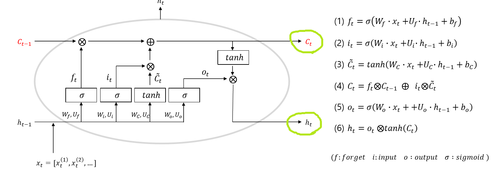
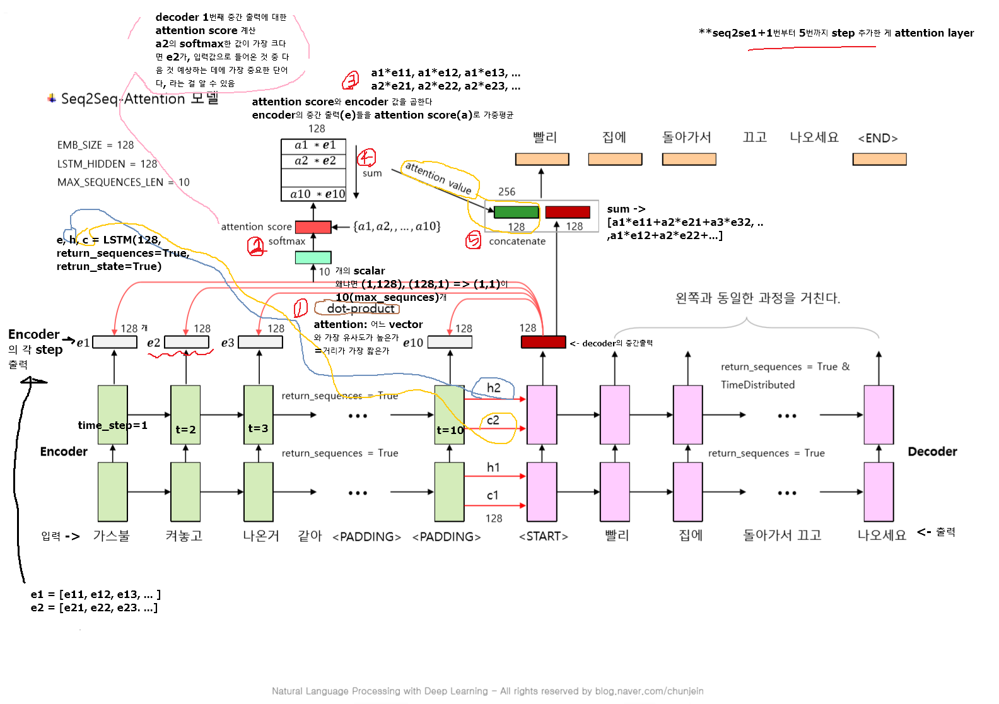

# NLP

<br>

<br>

## `Sequence to Sequence`

* NLP, Time Serise/Sin data 예측에 사용한다.<br>
* 기법 종류:
  * seq2seq (RNN) > SL(fine Tuning) → USL
  * Attention: RNN 기반 > SL(fine Tuning) → USL
  * Self Attention(TransFormer): RNN 제거하고 Attention만 사용 > SL(fine Tuning) → USL
    * 이유: 병렬 처리 곤란(1 Step 끝나고 다음 Step 진행하기 때문에), GV 발생
  * BERT<br>
* RNN  Encoder - Decoder
* Encoder : 발화자의 의도
  * 최종 출력 context vector : h, c
* Decoder : 청취자가 발화자의 의도 해석
  * Decoder의 입력과 출력은 모두 Answer 문장이다.
    * 다만 여기서 입력은 태그로 \<start>가 붙고
    * 출력은 \<end>가 붙는다<br>
* teacher forcing
  * 학습 시에는 입력값과 출력값을 모두 알기 때문에 한꺼번에 넣어 학습시킨다. 한 음절씩 입력할 필요가 없다.
  * predict 할 때는 출력값을 모르기 때문에 \<start>만 넣고 1 step(음절)씩 출력되도록 for문을 돌린다. <br>


> 그림 출처: 아마추어 퀀트, blog.naver.com/chunjein

|      | 설명                                                         | 특징                  |
| ---- | ------------------------------------------------------------ | --------------------- |
| h    | i와 f를 통해 나온 **결과값(출력값)을 얼만큼 사용할 것인가 조절** | f와 i의 가중평균 형태 |
| c    | **이전(과거)과 현재 값들을 얼만큼 사용할 것인가 조절**       |                       |
| i    | **이전**의 C를 얼마나 반영할 것인지 조절                     |                       |
| f    | **현재 입력값(x)과 이전의 출력값(h)**를 얼마나 반영할 것인지 조절 |                       |




> 그림 출처: [아마추어 퀀트](blog.naver.com/chunjein)

<br>

## code & 원리

* 입력 데이터가 2개, 출력 데이터는 1개로 총 3개의 데이터가 필요하다

* | encoder     | decoder      |
  | ----------- | ------------ |
  | many-to-one | many-to-many |

<br>

* return_state

  * |        | Seq2Seq의 LSTM                                               | 기존 LSTM                                | 차이                  |
    | ------ | ------------------------------------------------------------ | ---------------------------------------- | --------------------- |
    | LSTM() | LSTM(LSTM_HIDDEN, return_sequences=True, **return_state = True**) | LSTM(LSTM_HIDDEN, return_sequences=True) | *return_state = True* |

  > *return_state = True* : 사용하면, 중간 뉴런들 각각의 값을 뜻하는, 결과값으로서의 계산된 h와 c가 함께 출력되어 **출력값이 3개**가 나오게 된다.

    <br>

* decoder는 입력을 한꺼번에 받았으나, chat module에선 한 단어씩 입력받아야 한다. 따라서 입력부분의 shape이 달라진다. 

  > n개 → 1

  * 그래도 네트워크의 파라미터는 동일하다.

  * 순서:

    1. `encoder` & `decoder` 네트워크를 구성한다.

    * `encoder`: many-to-one으로 구성한다. 중간 출력은 필요 없고 decoder로 전달할 h와 c만 필요하다. h와 c를 얻기 위해 `return_state = True`를 설정한다.

    * `decoder`: many-to-many로 구성한다. target을 학습하기 위해서는 중간 출력이 필요하다. 그리고 초기 h와 c는 encoder에서 출력한 값을 사용한다

    2. `chatting 용 모델` **따로** 빌드: *"* 학습 모델(encoder & decoder)에서 나온 결과(w값)를 적용한다. *"* 

  <br>

   * *chatting 용 모델* > 사용자가 있는 ChatBot으로서 **실사용할 것.**

     1. 네트워크 구성

        * `encoder` & `decoder`  만들기.

          학습 때와 달리 문장 전체를 받아 recurrent하는 것이 아니라, **단어 1개씩 입력 받아서 다음 예상** 단어를 확인한다

          따라서, input shape의 변화 말고는 가중치를 뽑아내기 위해 실행했었던 '6-2. 파일' 속 encoder & decoder의 구성방식(층 개수, 정규화 했다면 정규화, loss 등)과 전부 같아야 한다.<br>

        * `Chatting용 model` 만듦

          * Chatting용 model은 encoder&decoder랑 달리 네트워크를 만드는 게 아니라, 

            실제 사용할 model을 만들므로 Encoder 및 decoder의 **w를 써야하므로 그 둘을 합쳐준다는 의미**에서 model을 만든다.

            * 따라서 Encoder의 출력을 입력으로 받기 위한 입력 input(예: ih1, ic1)을 만들어준다.

              ```py
              ih1 = Input(batch_shape = (None, LSTM_HIDDEN))
              ic1 = Input(batch_shape = (None, LSTM_HIDDEN))
              ih2 = Input(batch_shape = (None, LSTM_HIDDEN))
              ic2 = Input(batch_shape = (None, LSTM_HIDDEN))
              ```

                * Decoder에 넣으면 변하는 부분을 만든다.

                  ```python
                  dec_output1, dh1, dc1 = decLSTM1(decEMB, initial_state = [ih1, ic1]) 
                  ```

              >앞에서 encoder&decoder model을 만들었으니, 
              >
              >바로 위 code 中 Encoder의 입력 값(ih1, ic1)에서 w가 나올 텐데,  
              >
              >decoder의 가중치 값으로 쓴다(initial_state).

              <br>

     2. Question을 입력받아 Answer를 생성 해주는 알고리즘 작성(함수 만들기)

        * 궁금한 부분 & 해소:

          "챗봇의 Answer에서 '그 사람도 그럴 거예요' 中 '거예요' 다음에 문장이 또 나올 수 있지 않나? 어떻게 멈추는 거지?"

          > 답변: 챗봇 알고리즘을 다음 예상 단어가 \<END>이거나 \<PADDING>이면 더 이상 예상할 게 없도록 만들었기 때문.

          ```python
          
          ```

        # argmax로 해당 단어를 채택한다.

              nextWord = np.argmax(dY[0, 0])
            
              # 예상 단어가 <END>이거나 <PADDING>이면 더 이상 예상할 게 없다.
              if nextWord == word2idx['<END>'] or nextWord == word2idx['<PADDING>']:

          break

          ```
        
          ```

     3. Chatting 실행하는 함수 작성

        * 글 쓰는 input과 글 나오는 output이 부분을 만듦

<br>

### SMT

* Answer는 One-Hot encoding 형태로 출력
  * 따라서 softmax 사용
* 이전 단어들의 Sequence로 예측할 단어를 구함
  * 식에선 이전 단어가 첫 번째로 위치할 확률 등을 구함

<br>

<br>

<br>

<br>

## `Seq2Seq` & `Attention` 메커니즘

> 입력 문장이 긴 상황에서는 번역 품질이 떨어지는 현상이 나타났고, 이런 현상을 보정하기 위해 **중요한 단어에 집중**하여 Decoder에 바로 전달하는 Attention 기법이 등장했습니다. 기존 방식보다 **훨씬 더 많은 데이터를 Decoder에 전달**합니다.
>
> * 출처: [glee1228][https://glee1228.tistory.com/3]

<br>

* 그림:



> t = 단어 하나

<br>

* 원리 및 작동 순서:

  > 
  >
  > 
  >
  > 위 그림을 바탕으로 어떻게 Attention이 작용하는지 설명해보겠습니다.
  >
  > > 우선, Attention Decoder에서 나오는 첫 단어(위의 Je)를 만들기 위해 두가지를 준비해야합니다.
  > >
  > > 하나는 Attention Vector, 나머지 하나는 Step 5번째의 Decoder(빨간색)에서 나오는 hidden state입니다.
  > >
  > > 우선 Attention Decoder에 전달할 Context Vector를 만들어봅니다.
  > >
  > > 1. Encoder의 hidden state(h1,h2,h3,h4h1,h2,h3,h4)들을 step별로 구합니다.
  > > 2. 각각 step의 hidden state(h1,h2,h3,h4h1,h2,h3,h4)에 이전 step 디코더의 hidden state인 si−1si−1 를 각각 dot-product하거나 다른 socre 함수들을 사용해서 점수를 부여합니다.이 점수가 바로 Attention Score입니다.
  > > 3. 점수를 softmax합니다.(점수 합이 1)
  > > 4. Softmax된 점수에 해당하는 각각의 hidden state들을 곱해줍니다.
  > > 5. 점수에 곱해진 Vector들을 Sum up 해줍니다. => Context Vector
  > >
  > > Step 5번째의 첫 Decoder의 hidden state를 준비해줍니다.
  > >
  > > 여기까지 다 되었다면, 위 Je라는 Attention Decoder의 첫 hidden state를 내보낼 준비가 되었습니다.
  >
  > 어텐션의 기본 아이디어는 **디코더(Decoder)에서 출력 단어를 예측하는 매 시점(time-step)마다, 인코더에서의 전체 입력 문장을 다시 한 번 참고한다는 점** 입니다. 단, 전체 입력 문장을 전부 다 동일한 비율로 참고하는 것이 아니라, 해당 시점에서 예측해야할 단어와 연관이 있는 입력 단어 부분을 좀 더 집중해서 보게됩니다. 이 내용을 알고 Decoder의 단계로 넘어갑니다.
  >
  > * 출처: [glee1228](https://glee1228.tistory.com/3)


<br>

### code

* 순서

  1. 단어 목록 dict를 읽어온다.

  2. 학습 데이터 : 인코딩, 디코딩 입력, 디코딩 출력을 읽어온다.

  3. 평가 데이터 : 인코딩, 디코딩 입력, 디코딩 출력을 만든다.

     * 이때 쓸 attention layer 및 attention score 구하기

       1. Encoder 출력과 decoder 출력으로 `attention value`를 생성하고,
          decoder 출력 + attention value를 `concatenate`한다.

          ```python
          # LSTM time step = 4, SMB_SIZE = 3
          def Attention(x, y): # x : encoder 출력, y : decoder 출력
              # step-1:
              # decoder의 매 시점마다 encoder의 전체 시점과 dot-product을 수행한다.
              score = Dot(axes=(2, 2))([y, x])                   # (1, 4, 4)
              
              # step-2:
              # dot-product 결과를 확률분포로 만든다 (softmax)
              # 이것이 attention score이다.
              dist = Activation('softmax')(score)                # (1, 4, 4)
          
              # step-3:   
              # encoder 출력과 attention score를 각각 곱하는 단계 
              # encoder의 전체 시점에 위의 확률 분포를 적용해서 가중 평균한다.
              # 직접 계산이 어렵기 때문에 dist를 확장하고, 열을 복제해서
              # Dot 연산이 가능하도록 trick을 쓴다.
              # 이것이 attention value이다.
              # dist_exp = K.expand_dims(dist, 2)                   # (1, 4, 1, 4)
              # dist_rep = K.repeat_elements(dist_exp, EMB_SIZE, 2) # (1, 4, 3, 4)                                       
              # dist_dot = Dot(axes=(3, 1))([dist_rep, x])          # (1, 4, 3, 3)
              # attention = K.mean(dist_dot, axis = 2)              # (1, 4, 3)
          
              # step-4:
              # 교재의 step-3을 계산하지 않고 step-4를 직접 계산했다.
              attention = Dot(axes=(2, 1))([dist, x])
              
              # step-5:
              # decoder 출력과 attention (score)을 concatenate 한다.
              return Concatenate()([y, attention])    # (1, 4, 6)
          ```

     <br>

  4. 워드 임베딩 레이어. Encoder와 decoder에서 공동으로 사용한다.

     * 공동으로 사용함을 가정

       ```python
       K.clear_session()
       wordEmbedding = Embedding(input_dim=VOCAB_SIZE, output_dim=EMB_SIZE)
       ```

     <br>

5. Encoder

   * many-to-many로 구성한다. Attention value를 계산하기 위해 중간 출력이 필요하고 (return_sequences=True), 

     * decoder로 전달할 h와 c도 필요하다 (return_state = True)

     <br>

  6. Decoder

     * many-to-many로 구성한다. target을 학습하고 Attention을 위해서는 **중간 출력이 필요**하다. 

     * 그리고 초기 h와 c는 encoder에서 출력한 값을 사용한다(initial_state). 

     * 최종 출력은 vocabulary의 인덱스인 one-hot 인코더이다.

     * Attention 함수를 삽입한다.

       ```python
       att_dy2 = Attention(ey2, dy2) # ey2: encoder 출력값 # dy2: decoder 출력값
       ```

     * activation='softmax'를 사용한다

       ```python
       decOutput = TimeDistributed(Dense(VOCAB_SIZE, activation='softmax'))
       ```

  <br>

7. Model

   * loss='sparse_categorical_crossentropy'

  <br>

  8. 학습 (teacher forcing)

     * 주의:

       loss = sparse_categorical_crossentropy이기 때문에 target을 one-hot으로 변환할 필요 없이 integer인 trainYD를 그대로 넣어 준다. trainYD를 one-hot으로 변환해서 categorical_crossentropy로 처리하면 out-of-memory 문제가 발생할 수 있다.

  <br>

  9. 학습 결과를 저장한다

     ```python
     model.save_weights(MODEL_PATH)
     ```

     <br>

<br>

<br>

<br>

* 참고:

  > 아마추어 퀀트, blog.naver.com/chunjein
  >
  > ckdgus1433. 2019. 8. 7. "Attention Mechanism(seq2seq)". http://blog.naver.com/ckdgus1433/221608376139. 튜토리얼로 익히는 머신러닝/딥러닝
  >
  > ratsgo. 2017.05.12. "Sequence-to-Sequence 모델로 뉴스 제목 추출하기". https://ratsgo.github.io/natural language processing/2017/03/12/s2s/. ratsgo's blog for textmining