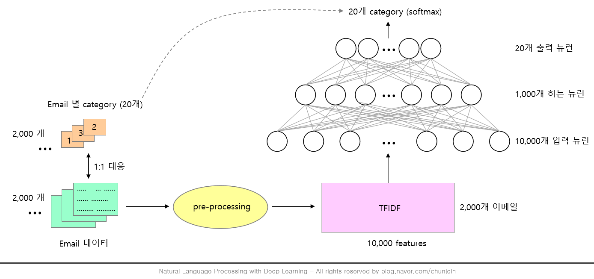
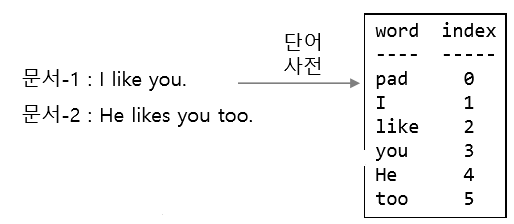
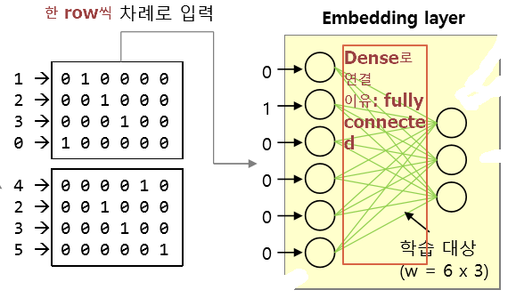

# NLP & 딥러닝


## Email - Classification

* 딥러닝을 이용하여 20개의 카테고리로 분류된 이메일 데이터를 학습하고, 시험 이메일을 20개 카테고리 중 하나로 분류한다. 
* Email별 카테고리(20개. 총 2,000개) → (1:1 대응: label 매겨 학습 시킴) email 데이터 2,000개 → text 추출 → pre-processing → 수치화 → TF-IDF(10,000개의 Feature) → 신경망에 넣기 (10,000개 뉴런 → 1,000개 히든 뉴런 → 20개 출력 뉴런) → 20개 category (softmax)
* 
  * `pre-processing`: 지도학습. pos_tag, token, stemer(어근) 등의 방법으로 전처리. 이게 오래 걸림


----------------------


## `Embedding layer`

* 수치화 방법

* |      | 빈도기반                                              | 임베딩                                                       |
  | ---- | ----------------------------------------------------- | ------------------------------------------------------------ |
  | ex:  | `TF-IDF`, `BOW`, `Doc2Bow`, `Co-occurtance`, `Matrix` | `word2vec`                                                   |
  | 특징 | 통계 기반                                             | 학습 기반<br />==딥러닝을 통해 수치화 시켜서**단어에 의미를 부여**할 수 있는 개념== |
  |      | '의미'란 개념이 없다                                  | '의미'란 개념이 있다                                         |
  |      |                                                       | 단어에 의미를 부여할 수 있음                                 |

  > 단어의 의미: 맥락을 분석할 수 있음

  

* '단어' 기반의 NLP
  * 현재의 NLP의 기본 원리
    * EX: `Token`, `pos-tag`, `stemmer`
* 단어 자체로는 의미를 갖지 못하고, 단어가 조합을 이루어야 의미를 형성할 수 있음 
  
  * `character-based NLP`도 연구 중이긴 함 


* `Embedding` 방법도 위 그림과 같은데, 다만 단어에 의미를 부여하지 못하는 count based인 `TF-IDF` → `Embedding`으로 바꿈 
  * ==`Embedding` 위치: 입력층과 은닉층 사이에 끼어든다==


### `Embedding` 방법:

1. 문서의 단어 `Vocabulary` 딕셔너리 형성

   >  
   >
   > 이 과정을 거치면
   >
   > 문서-1 : [1,2,3,0]
   >
   > 문서-2 : [4,2,3,5]로 변환됨
   >
   > * 문서-1의 [1,2,3,0] '0'은 문서 길이를 맞추기 위한 `padding`
   > * `padding`: 비교하려는 문서마다 문장의 길이가 다르므로 `.pad_sequences` 사용하면,`vocabulary` 자체에 `padding`이 삽입됨

2. 문서별로 `one-hot encoding`

   >  
   >
   > * one-hot encoding한 이유:
   >
   >   vector 내적의 합이 0인 직교행렬을 만들기 위함. 
   >
   >   내적 0 = 유사도 0
   >
   >   따라서 먼저 모든 단어의 의미를 초기화한다.
   >
   >   이후 ==Embedding layer를 거치면 각 word vector들이 **어떤 의미를 갖는 수치 vector로 환원된다.**==
   >
   > * 이때 생각해야 하는 부분은 '단어를 몇 byte의 수치로 표현할 것인가?' 이며, 이건 사람이 결정해야 함 

3. `Embedding layer`에 넣어 학습하기

   >  
   >
   > * `Embedding layer`: 일반 layer에 `Embedding layer`를 넣은 것 → 학습할 수 있게 되었음 
   > * `Embedding layer`의 입력층의 뉴런 개수: 사전에 등록된 단어 개수(뉴런 개수는 임의적으로 설정 가능)
   > * 단어 1개의 `latent feature` 형성. 
   >   * `latent feature`: 차원이 늘어나거나 줄어든 채로 데이터를 잘 설명할 수 있는 잠재 공간에서의 벡터

   * `Embedding layer` 자세히 보기:

     > 학습을 통한 문서-1 의 word embedding 표현
     >
     >  
     >
     > * 입력된 단어는 one-hot으로 단어간 유사도 = 0(직교행렬)이었으나, Embedding vector로 표현된 단어들에는 유사도가 존재한다. 의미적으로 가까운 단어들은 유사도가 높다
     >
     >   * ex: love you / love hate 中 love you의 유사도가 더 높다. 
     >
     >   * ex: wine __  __  __  __ objok
     >
     >     ​      __ __ __ __ __ objok
     >
     >     ​	 모델을 돌리면 여기서 objok는 wine의 종류라고 알 수 있다
     >
     > * `Embedding layer`가 하는 일:
     >
     > 1. (수치화된 word data로 `one-hot vector`를 생성한다)
     > 2. 위의 1의 one-hot vector와 w행렬을 곱한다 
     >    1. one hot * W
     >       * ex) (5,500) * (500,64) = (5,64)
     >    2. 의문: 1번대로라면 보통 "vocabulary는 3만개가 되어 곱행렬의 수가 늘어나기 때문에 줄어줄 필요가 있다 *?* "
     >       * 아니다. 직교 행렬(one-hot vector)일 경우 곱행렬을 할 필요가 없다.
     >       * 이유:
     >       * ==(그림 추가)~~~==
     >       * 따라서 행렬이 아무리 커도 곱행렬(곱셈)이 필요 없다 
     >       * look-up 사용

4. `Embedding layer`를 `DL layer`에 넣고 학습 + 역전파

   >  


* `embedding` → 일반적인 `DL` N/W(`LSTM`, `CNN`등) → 출력층  → W 역전파  →  `embedding` 단어들이 의미를 갖게됨

  * 역전파되어 의미를 갖게된 수치벡터들은 우리가 공유하는 일반적인 단어의 의미가 아니라, ==어떤 특정 목적==을 위한 의미가 된다.
    * ex) '어떤 특정 목적' : Email classification 등

  


#### `Embedding` 그림 총 정리:


-----------------------------------


### 실습


####  Word Embedding & CNN 개념


* Word Embedding&CNN, LSTM의 `단점`: 

1. 단어에 의미를 부여하지만, 맥락상의 의미가 다른 단어를 구분하지는 못함
   * 동의어 구분 못함
     * bank: 은행과 bank:둑을 구분하지 못한다
   * 형태적으로 같은 단어는 모두 동일한 `Embedding vector`를 갖는다
     * 이유: 같은 w를 공유하기 때문 ex: ~의 love


2. 계속 `vocabulary`를 업데이트 할 수 없는데, `vocabulary`의 업데이트 주기와 새로운 `말뭉치(corpus)` 투입 사이의 간극으로, 새로운 말뭉치가 과거의 `vocabulary`을 고려하기 때문에 문제가 발생한다				
  
   * 없는 단어가 발생한다
   
     * out of vocabulary(`OOV`)
   
       * 따라서, 모르는 단어는 1로 coding한다
   
         * | idx  |              |
           | ---- | ------------ |
           | 0    | ← padding 용 |
           | 1    | ← OOV용      |
   
           > 사용자가 임의 설정해야 함 
       
     
      
  
3. `padding`: 문장마다 길이가 다르므로 맞추기 위해 계속 `padding`을 해줘야 한다
  
   * LSTM에서
   
     * `time step`을 고정시키면 반드시 n개가 필요하여 부족하면 `padding`으로 채워줘야 함
   
         * 이때 `padding` 귀찮으면, 
   
           > x = Input(batch_size = (None, None, f=8))로 None을 2번 써도 됨
           >
           > 근데 이렇게 하면, 학습 시킬 때가 문제다. `.fit` 할 때, `batch_size`를 따로 또 적어줘야 한다.
           >
           > model.fit(A, batch_size = 64) 
           >
           > model.fit(B, batch_size = 1)
           
     
     


#### Embeddin & cnn-lstm 적용

1. `단어 간 유사도 파악`
   1. CNN or LSTM 모델 학습(fit) 후
   2. embedding layer만 따로 빼서
   3. 유클리디안 거리(유사도) 분석 진행
   4. 유클리디안 거리의 숫자가 작을수록 두 단어 사이의 거리가 가깝다.

```python
### model의 embedding layer = model.layers[0]
### embedding layer의 선이자 가중치 확인법: .get_weights()

a = np.array(model.layers[0].get_weights()) # a.shape = (1, 6000, 60)
father = a[0,wind['father']] # a[0].shape = (6000, 60)
mother = a[0,wind['mother']]
daughter = a[0,wind['daughter']]

from sklearn.metrics.pairwise import euclidean_distances # 숫자가 작을수록 유사한 것 

f_m_e_e = euclidean_distances([father, mother]) # 거리 계산할 때, 비교하고 싶은 건 []를 쳐서 넣어주기  
f_d_e_e = euclidean_distances([father, daughter])
m_d_e_e = euclidean_distances([mother, daughter])
euclidean_distances([father, mother, daughter])

for i in [f_m_e_e, f_d_e_e, m_d_e_e]:
    print(i.mean())
```

> * 참고
>
> ```python
> from sklearn.metrics import jaccard_score
> # 자카드 유사도는 단어의 빈도를 사용한 측정 방법인듯
> ```


2. `CNN Embedding과 LSTM Embedding` 따로 구해서 성과 분석 = `병렬 처리`

   * `CNN`이 느끼는 단어의 의미와 `LSTM`이 느끼는 단어의 의미가 다르다, 라는 관점에
    `Embedding layer`를 같이 쓸까(직렬), 따로 쓸까(병렬) 구분 
   
1. 학습 **데이터 구성**
   
2. 문장 **padding**
   
3. (편의를 위해) CNN, LSTM **변수 정의**
   
   4. 각각 **모델 빌드**
   
   1. input
      2. embedding
   3. lstm / cnn(→ pooling → flatten → Dense)
   
5. **Concat**
   
   6. **성능 확인 **
   
      ```python
      y_pred = model.predict(x_test)
   y_pred = np.where(y_pred > 0.5, 1, 0)
      print ("Test accuracy:", accuracy_score(y_test, y_pred))
      ```
   
      ```python
   y_train_predclass = model.predict_classes(x_train, batch_size=batch_size)
      y_test_predclass = model.predict_classes(x_test, batch_size=batch_size)
      ```
   ```
   
      * predict는 probability를 predict_class는 label을 제공
   
        >  | predict의 경우     | predict_classes의 경우 |
        >   | ------------------ | ---------------------- |
        >   | [[0.22520512]      | [[0]                   |
        >   | [0.9520419 ]       | [1]                    |
        >   | [0.9672848 ]       | [1]                    |
        >   | [0.02690617]]      | [0]]                   |
        >   | functional keras() | sequential keras()     |
        
        
   ```


##### 학습 데이터 구성

### code

* imdb data 기준 code

* imdb.load_data: 빈도별 내림차순으로 정렬된 총 88,584 단어(vocabulary) 中 6,000개의 단어에 index가 표시되어 있다.(제작자가 만들어 둔 것임)

  * 6,000번째 이후 데이터는 out-of-vocabulary 표시인 '2'로 표시되어 있음
  * y_train/test: (binary data) 긍정적 리뷰: 1, 부정적 리뷰: 0
  * num_words=max_features 설정했기 때문에 vocabulary의 6,000번째 이후 데이터는 out-of-vocabulary 표시인 '2'가 표시돼 있다.

  ```python
  max_features = 6000    # max_features : 최대 단어수
  (x_train, y_train), (x_test, y_test) = imdb.load_data(num_words=max_features)
  ```

  > 0 : padding, 1 : start, 2 : OOV, 3 : Invalid를 의미

* vocabulary를 생성

  * word2idx : {'단어' : idx} 구조
  * idx2word : {idx : '단어'} 구조

  ```python
  word2idx = imdb.get_word_index()
  idx2word = dict((v,k) for k,v in word2idx.items())
  ```

* volcaburary idx는 1부터 시작한다. idx2word[1] = 'the'
  x_train에는 단어들이 vocabulary의 index로 표시돼 있다.
  그러나 idx2word에는 padding=0, start=1, OOV=2, Invalid=3은 **포함돼 있지 않다.**
  따라서 idx2word의 idx를 3증가 시키고, 아래와 같이 0, 1, 2, 3을 **추가한다.**
  즉, **실제 사용된 단어는 idx 4번부터다. **

  ```python
  idx2word = dict((v+3, k) for k, v in word2idx.items()) # word2idx.items() = (idx, 단어)순으로 나옮
  idx2word[0] = '<PAD>'  # padding 문자 표시
  idx2word[1] = '<START>'  # start 문자 표시
  idx2word[2] = '<OOV>'  # OOV 문자 표시
  idx2word[3] = '<INV>'  # Invalid 문자 표시
  word2idx = dict((k, v) for v, k in idx2word.items()) # 요걸 실제 사용
  ```

* 숫자로 표시된 x_train을 실제 단어로 변환해서 육안으로 확인해 본다.
  (학습과는 무관하다.)

  ```python
  """
  x_train은 idx 값만으로 구성된 list이므로, 
  이를 (idx, word)로 되어 있는 word2idx에 넣는다면 딕셔너리의 key값이 일치하는 x_train을 찾고, 
  그것의 value값을 뽑으면 x_train의 idx가 무슨 단어를 뜻하는지 알 수 있다.
  (x_train은 0, 1, 2, 3 전처리를 거친 파일이므로 위의 idx2word, word2idx 작업을 통해 두 파일의 길이를 맞춰주었다.
   이제 각 idx의 word만 확인하면 된다.)
  """
  def decode(review):
      x = [idx2word[s] for s in review] 
      return ' '.join(x)
  decode(x_train[0])
  
  ####### 여기까지가 주어진 데이터에 관한 부분이다.
  ```


##### Embedding + CNN

* 1개 리뷰 문서의 단어 개수를 max_length = 400으로 맞춘다.
  400개 보다 작으면 padding = 0을 추가하고, **400개 보다 크면 뒷 부분을 자른다(← index 번호 400 이후는 안 본단 뜻).**

```python
max_length = 400       # 한 개 리뷰 문서의 최대 단어 길이
x_train = sequence.pad_sequences(x_train, maxlen=max_length)
x_test = sequence.pad_sequences(x_test, maxlen=max_length)
```


* Deep Learning architecture parameters

```python
batch_size = 32
embedding_dims = 60 #단어 1개를 60개의 수치(feature)로 표현 
num_kernels = 260        # convolution filter 개수
kernel_size = 3          # convolution filter size
hidden_dims = 300
epochs = 1

xInput = Input(batch_shape = (None, max_length))
emb = Embedding(max_features, embedding_dims)(xInput) #(400,6) 한 단어(row)당 60개의 wordvector로 수치화한 것 
emb = Dropout(0.5)(emb)
conv = Conv1D(num_kernels, kernel_size, padding='valid', activation='relu', strides=1)(emb)
conv = GlobalMaxPooling1D()(conv)
ffn = Dense(hidden_dims)(conv)
ffn = Dropout(0.5)(ffn)
ffn = Activation('relu')(ffn)
ffn = Dense(1)(ffn)
yOutput = Activation('sigmoid')(ffn)

model = Model(xInput, yOutput)
model.compile(loss='binary_crossentropy', optimizer='adam')
print(model.summary())
```


* 학습

```python
hist = model.fit(x_train, y_train, 
                 batch_size=batch_size, 
                 epochs=epochs,
                 validation_data = (x_test, y_test))
```


* 성능 확인

```python
y_pred = model.predict(x_test)
y_pred = np.where(y_pred > 0.5, 1, 0)
print ("Test accuracy:", accuracy_score(y_test, y_pred))
```


* 참고: 아마추어 퀀트, blog.naver.com/chunjein