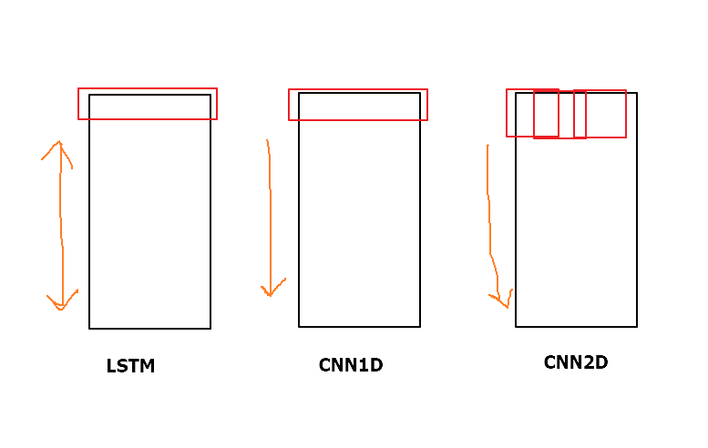

<br>

<br>


# W(weights)

* 네트워크 및 model build까지 완성해서 실행되어 역전파 되었을 때 형성된다.
* `compile에서 w`: 네트워크 만들고 난 후 model build하는 과정. optimizer & loss 값을 정의해주는 부분임. w는 만들어져있지 않다.
* `fit에서 w`: fit은 train data 사용. A 다음 B가 **나온다고 저장함**
* `predict에서 w`: predict(예측)는 test data 사용. 예측 모델 기준으로 A를 넣으면 B가 **나오게 하는** 어떤 것(Thing)

<br>

<br>

<br>

# Hyper parameter

* `weight decay`(annealing): epoch(alpha)를 처음에는 적당히 높게 했다가, 점차 줄여 나가는 방법

<br>

<br>

<br>

# Dense

* `Dense`: fully connected

* `ANN(FNN)`에서는 여러 `Dense`를 써도 되지만, `RNN(LSTM)`에선 마지막 층에서만 `Dense`를 써야함.
  * `CNN`에서는 여러 `Dense` 써도 될까?
  * => 일단... `lstm`에서 `lstm() → Dense → lstm()`은 `lstm 네트워크가 2개` 만들어진다고 보면 된다. `lstm() → Dense` 했을 때, `1개의 네트워크`가 형성된 것
  * => 그리고 `CNN`은 일종의 잘 짜여진 레시피라서 `con1D → pooling → Dense → con1D → pooling`은 위 `lstm`처럼 좀 이상한 네트워크 구조가 되는 거라 생각함...

* Dense(1, activation='sigmoid')

* **LSTM에서 FNN으로 보내는 마지막 Dense에선 relu 쓰면 안됨**

<br>

<br>

<br>


# FNN(순방향 신경망)

* ↔ RNN

* hidden 층에서

  * Dense(4, `activation` = 'sigmoid', `kernel_regularizer`=regularizers.l2(0.0001), activation='relu')
  * `Dropout`(rate=0.5)

  <br>

* `BatchNormalization`(momentum=0.9, epsilon=0.005, center=True, scale=True, moving_variance_initializer='ones')

<br>

* `predict`까지 끝낸 **연속형** `yHat` 값을, `np.where` 써줘서 **바이너리 형태**로 변환 

  ``` python
  np.where(yHat > 0.5, 1, 0)
  # 딥러닝_파일: 4-4.ANN(Credit_Keras)_직접 해보기_커스텀loss.py
  ```

<br>

* `history` 활용

  ```python
  hist.history['loss']
  hist.history['val_loss']
  # 딥러닝_파일: 4-4.ANN(Credit_Keras)_직접 해보기.py
  ```

<br>

* 학습/평가/예측용 model로 나누었을 때 **평가 데이터 활용**

  ```python
  model.fit(trainX, trainY, validation_data=(evlX, evlY), epochs=200, batch_size=50)
  ```

<br>

<br>

<br>


# LSTM

* long term(장기기억, 전체적 흐름), short term(단기기억, 최근의 흐름)

* |                 | 설명                                                         |
  | --------------- | ------------------------------------------------------------ |
  | 2층             | `lstm()`을 2번 써준다                                        |
  | 양방향          | `bidirectional` + `merge_mode = ‘concat’` <br />FNN, BFN 값을 merge_mode 형태로 합쳐서 list형으로 되돌려줌<br />단방향(FBN)은 ‘이후’만 기억, 양방향(FBN+BFN)은 ‘이전’+’이후’ 모두 기억 |
  | many-to-many    | `return-sequences = True`<br />LSTM 뉴런 **각각의 중간 스텝에서 나오는 각각의 출력(h)**을 (바로 위 뉴런으로도) 사용(전파)한다는 뜻 |
  | timedistributed | `timedistributed()`<br /> **FFN으로 가기 전** LSTM 마지막 층에서 각 뉴런의 각 지점에서 계산한 오류를 다음 층으로 전파 |

<br>

* LSTM이 many-to-many 상태에서 FNN으로 가면 각각의 Output 값이 나온다
* NLP의 챗봇, 기계번역 등에서 사용함.
    * Input > 안녕 만나서 반가워
    * Output > 저도 반갑습니다
    * 3개의 출력층. 비어 있는 1개는 padding 
    * Q. ... padding은 어디로?

<br>

* LSTM에서 사용되는 h와 c

  |      | 역할              | 특징                                                  |
  | ---- | ----------------- | ----------------------------------------------------- |
  | h    | **위, 왼쪽** 전파 | LSTM이 1층일 땐 c랑 똑같이 왼쪽으로 밖에 전파 못한다. |
  | c    | **왼쪽** 전파     |                                                       |

  > h와 c 둘다 처음엔 0으로 시작한다.

  


<br>

<br>

<br>

# CNN

* 이미지를 대표할 수 있는 특성들을 도출해서 FNN에 넣어줌

* | code                                                         | 설명                                                         |
  | ------------------------------------------------------------ | ------------------------------------------------------------ |
  | `Input`(batch_shape = (None, nStep, nFeature, nChannel))     |                                                              |
  | `Conv2D`(filters=30, kernel_size=(8,3), strides=1, padding = 'same', activation='relu') |                                                              |
  | `MaxPooling2D`(pool_size=(2,1), strides=1, padding='valid')  | - 경우에 따라 conv2D, pooling 더 써줄 수 있음<br />- `GlobalMaxPooling1D()`도 있음 |
  | `Flatten()`                                                  | 2D는 4차원이라 shape 맞추려고 보통 flatten을 써줌<br />1d는 안 써도 되는 듯(?) |
  | `Dense`(nOutput, activation='linear')                        |                                                              |

<br>

<br>

<br>


## LSTM과 CNN의 차이

* 둘다 (흐름을 보는)시계열 데이터에 사용할 수 있다.
* LSTM과 CNN1D는 기능은 비슷하지만 CNN1D는 table 中 **(colum 전체+n row)아래 방향으로의 흐름**을 보는 거고, 
* LSTM은 bidirectional 을 사용해서 table 中 **위/아래로 흐름**을 이동시켜서 볼 수 있다.
* CNN2D는 kernel_size, pooling 등을 통해 tabel 中 **(n colum(일부분) + n row(일부분) = 내가 focus를 맞춰 보고 싶은 부분)에 따라 그 흐름을 볼 수 있다는 데**서 차이가 있다.



<br>

<br><br>

# activation

* | activation(비선형 함수) | loss                                                         |
  | ----------------------- | ------------------------------------------------------------ |
  | `softmax`               | `sparse_categorical_crossentropy`                            |
  | `sigmoid`               | `binary_crossentropy`                                        |
  | `linear`                | `mse`                                                        |
  | `relu`                  | ← Hidden layer에 씀. 기울기가 0이기 때문에 뉴런이 죽을 수 있는 단점 有 |
  |                         |                                                              |
  | Leakly ReLU             | 뉴런이 죽을 수 있는 현상 해결                                |
  | PReLU                   | x<0 에서 학습 가능                                           |
  | granger causality       | 통제된 상황에서 인과관계가 가능하다고 말할 수 있음. 시계열 데이터에서 쓰일 수 있음 |

  > * sparse_categorical_crossentropy
  >
  > ```python
  > model = Model([encoderX, decoderX], outputY)
  > model.compile(optimizer=optimizers.Adam(lr=0.001), loss='sparse_categorical_crossentropy')
  > ```
  >
  > * sparse 안 쓸 거면 위에 'outputY'를 to_categorical()로 변형 후, loss 함수로 "categorical_crossentropy" 사용
  > * target이 one-hot encoding되어 있으면 categorical_crossentropy,
  >   target이 integer로 되어 있으면 sparse_categorical_crossentropy를 쓴다.
  >   sparse_categorical_entropy는 integer인 target을 one-hot으로 바꾼 후에 categorical_entropy를 수행한다.

  <br>
  
* 딥러닝 네트워크(DN)의 노드는 입력값을 전부 더한 후, 활성화 함수(Activation function)를 통과시켜 다음 노드에 전달한다.

  * 이때 사용하는 활성화 함수는 비선형 함수를 쓴다. 

<br>

<br>

<br>

## softmax - sigmoid

| 구분           | 함수                           | code                                                         |
| -------------- | ------------------------------ | ------------------------------------------------------------ |
| 회귀           | 항등함수(출력값을 그대로 반환) |                                                              |
| 분류(0/1)      | sigmoid                        | # 시험 데이터로 학습 성능을 평가한다<br/>predicted = model.predict(test_input)<br/>test_pred = np.where(predicted > 0.5, 1, 0)<br/>accuracy = (test_label == test_pred).mean() |
| 분류(multiple) | softmax                        |                                                              |

>  Cross-Entropy : 예측한 값과 실제값의 차를 계산. entropy 값이 감소하는 방향으로 진행하다 보면 최저 값을 찾을 수 있다. 
>
>  * 출처: sshkim Sh.TK. 2017. 8. 23. "[모두의딥러닝] Softmax Regression (Multinomial Logistic Regression)". "https://sshkim.tistory.com/146"

>  argmax 을 사용하면 2라는 값이 나온다. 가장 큰 값의 위치가 2번째에 있는 1이기 때문
>
>  * 출처: JINSOL KIM. 2017. 12. 24. "Softmax vs Sigmoid". https://blog.naver.com/infoefficien/221170205067

<br>

<br>

<br>

## ReLu

* 히든층에 자주 쓰임

* 그냥 CNN이든 LSTM이든 출력층 Dense에 Relu 쓰지 말자

  * LSTM에선 Relu 안 쓰는 게 좋음. 특히 출력층엔 쓰면 안 됨.


<br>

<br>

<br>


# 학습(compile), 예측(predict)


## optimizer

* | 종류(빈도순)               |
  | -------------------------- |
  | `adam`                     |
  | Adadelta, RMSprop, Adagrad |
  | `momentum`                 |
  | GD, NAG                    |

* 최적화가 잘 안 되면 글로벌 minmun을 찾지 못하고 로컬 minimum에 빠진다. 이때 로컬 minimum을 **어떻게 빨리** 탈출할 수 있을지 U턴 메소드를 쓸지, 다른 1차 미분방법(GD)를 쓸 지 결정하게 된다. 

<br>

<br>

<br>

## epoch

* `epoch` 수치가 커지면 `optimizer`가 일을 해서 local이 아닌 global을 찾아간다.
* 그런데 너무 크면 overfitting
* 따라서 적당한 `epoch` 설정이 필요 

<br>

<br>

<br>

## Batch_size

* data가 크면 `batch_size`도 크게
  * 25,000개의 raw data라면 `batch_size` = 20 보다 300 이 정도로 설정


<br>

<br>

<br>

-----------------------

<br>

<br>

<br>


# NLP & DL


## SGNS

| 용어          | 설명                      | CODE                                | 참고                             |
| ------------- | ------------------------- | ----------------------------------- | -------------------------------- |
| pre-trained   | SGNS에서 학습한 We를 적용 | model.layers[1]**.set_weights**(We) | 해당 code 적용 후 model fit 진행 |
| fine-training |                           |                                     |                                  |

<br>

* SGNS에 모델 학습(fit) 시, 학습을 따로 시키는 이유?

  ```python
  # 학습
  hist = model.fit([X[:, 0], X[:, 1]], X[:, 2], 
                   batch_size=BATCH_SIZE,
                   epochs=NUM_EPOCHS)
  ```

  > *  각기 연결된 가중치 선이 구분되어 있기 때문에

<br>

* SGNS 모델 만들 때 dot을 한다면, 

  1. **axis=2**    *@2*

     → 후에

  2. reshape**(())**    *@괄호 두 개*

<br>

* SGNS로 만든 Embedding의 w(가중치)를 basic한 word data에 적용할 때, load_weights 사용하는 방법도 있다.

  * 근데 이땐 shape을 맞춰줘야 한다.

  ```python
  w = encoder.load_weights('model_w.h5') # 가중치(w) 불러온 후,
  emb = Embedding(max_features, embedding_dims, load_weights = w)(xInput) # embedding layer에 바로 적용
  ```

  * 보통 이런 느낌으로 씀

    ```python
    weights = load_weights()
    embedding_layer = Embedding(input_dim=V,
                                output_dim=embedding_dim,
                                input_length=input_length,
                                trainable=False,
                                weights=weights,
                                name='embedding')
    ```

    

<br>

<br>

<br>

## Embedding & pad_sequences

<br>

### word2vec 기준

| word2vec      | code                                                         | input                                                  | output                                                 |
| ------------- | ------------------------------------------------------------ | ------------------------------------------------------ | ------------------------------------------------------ |
| tokenizer     | tokenizer = Tokenizer()<br />tokenizer.fit_on_texts(clean_train_review)<br />train_sequences = tokenizer.texts_to_sequences(clean_train_review) | [안녕, 만나서, 반가워]                                 | [13, 4, 3]                                             |
| pad_sequences | train_inputs = pad_sequences(train_sequences, maxlen=MAX_SEQUENCE_LENGTH, padding='post') | [13, 4, 3]                                             | ([0,0...1,..],<br />[0,0,0,1,0,...],<br />[0,0,1,...]) |
| Embedding     | embedding_layer = Embedding(input_dim=VOCAB_SIZE, output_dim=EMB_SIZE) | ([0,0...1,..],<br />[0,0,0,1,0,...],<br />[0,0,1,...]) | [0,0...1,..] -> ANN layer                              |

> embedding_layer 는 결국 pad_sequence된 단어들끼리 모임. 즉, 1개 문장에 대한 임베딩 행렬이 됨 
>
> 1개 단어 = 1개 임베딩 레이어=벡터값

<br>

<br>

### doc2vec 기준

| doc2vec        | code                                                         | input                                                        | output                                                       |
| -------------- | ------------------------------------------------------------ | ------------------------------------------------------------ | ------------------------------------------------------------ |
| TaggedDocument | documents = [TaggedDocument(doc, [i]) for i, doc in enumerate(sentences)] | [...,'laughabl',<br/>  'horror'],<br/> ...]                  | TaggedDocument(words=['move', 'last', ... 'horror'], tags=[999]) |
| Embedding      | model = Doc2Vec(vector_size=300, alpha=0.025, min_alpha=0.00025, min_count=10, workers=4, dm =1) | TaggedDocument(words=['move', 'last', ... 'horror'], tags=[999]) | [벡터값]                                                     |

> tags=[999] : 999번 째 문장
>
> Embedding은 model.build_vocab, model.train 거치면 한 문장에 대한 하나의 벡터가 나온다.
>
> (word2vec의 경우 한 문장에 있는 각각의 단어 수만큼 벡터가 나온다.)
>
> 1개 문장 = 1개 임베딩 레이어 = 1개 벡터값

<br>

<br>

<br>


# ChatBot

<br>

## Sequence to Sequence

| encoder | decoder | 가능/불가능 |
| ------- | ------- | ----------- |
| 1층     | 2층     | *불가능*    |
| 1층     | 1층     | 가능        |
| 2층     | 1층     | 가능        |
| 2층     | 2층     | 가능        |

> "굳이 2층으로 할 필요가 있는가?"
>
> → 1층으로 하는 건 선형의 개념. 2층은 비선형의 개념이다.
>
> 비선형이 분류를 더 잘해낼 수도 있지만, overfitting의 위험이 있다. 

<br>

<br>

<br>


-----------

<br>

# 기타

<br>

## 유클리디안 거리

* 거리 계산할 때, 비교하고 싶은 건 `[]`를 쳐서 넣어주기  

  ```python
  euclidean_distances([father, mother])
  ```

<br>

## 가중치 저장(Save)

* Embedding (left side) layer의 W를 저장할 때, [2]를 저장한단 사실 알아두기

  ```python
  with open('data/embedding_W.pickle', 'wb') as f:
      pickle.dump(model.layers[2].get_weights(), f, pickle.HIGHEST_PROTOCOL)
  ```

<br>

## 영역별 code & 논문 참고하기 좋은 site

* SOTA site

  https://paperswithcode.com/sota

<br>

<br>

<br>