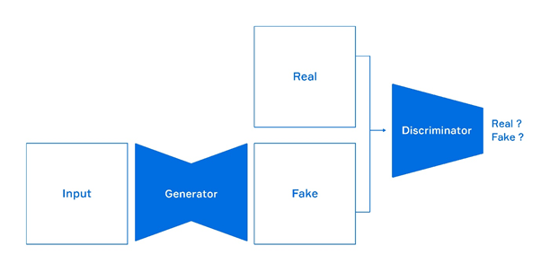
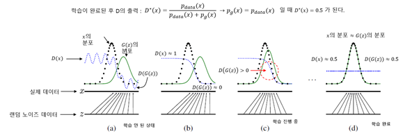

# GAN

* 비지도학습(UL) 방식의 이미지, 문서, 음성 등의 데이터를 **생성(모방)하는 알고리즘**
* **비모수적방법**으로도 비교적 정확한 **sampling이 가능**함 
* 위조 데이터 생성 및 판별에 사용 
   EX) 이미지 색깔(색칠) 해주는 프로그램, 딥페이크 영상

> 출처: https://www.naverlabs.com/storyDetail/44

## 그림 보충 설명:

1)  `Real`: 실제 데이터(이미지, 음성 등)

2)  `Input`: 랜덤 데이터. **노이즈 섞인 것**. 	*But,* Generator 통과하면, Real data 같은 것으로 변환돼 나온다.

3)  `Generator(network)`: `생성자`. **진짜 같은 가짜(Fake) 생성**

4)  `Discriminator(network)`: `판별자`. **실제 데이터(Real)와 가짜 데이터(Fake)를 판별**함

 

 

## **즉, 총 2개의 네트워크 사용:**

1)  `Discriminator`: real or fake 판별자

2)  `Generator`: fake 생성자

 

 

## Gan의 loss function:

* `minGmaxDV(D,G) = logD(x) + log(1-D(G(z)))`
* 학습을 반복하여 (Pg = Pdata가 되어) Discriminator가 구별 불가능인 상태(‘D(x)=0.5’)로 수렴하도록 
   → 마치 Generator가 x를 만들어낸 것처럼 됨 

| Discriminator   | Generator       |
| --------------- | --------------- |
| 엔트로피 최대화 | 엔트로피 최소화 |

> 엔트로피: 정보의 가치(정보량)과 ~

**1)**  **`Discriminator`**(network): **`maxV(D, G)`**로 학습. D(x) = 1 and D(G(z)) = 0일 때 최대

* *why?* D(G(z))가 1이 되고, D(x)가 1이 되니까

2)  **`Generator`** network: **`minV(G)`**로 학습. D(G(z)) = 1 일 때 최소. 이때(D(x)는 상관 X)

* *why?* D(G(z))가 0이 되니까

 

### 원리:

> 출처: Goodfellow 논문 공식

 

1. `Discriminator`를 k번 학습시키고, `Generator`를 1번 학습시킨다.

   → `D`가 `G`보다 더 많이 학습된다.    *****`D`: `Discriminator` / `G`: `Generator`

    

   *이에 따라* >

   1) Real Data와 Fake Data를 구별해내는 `D loss`는 점점 더 작아져 영향력이 줄어들고,

   2) `D`와 `G`는 점점 더 비슷해지며,

   3) `KL`이 적어지고,   *****`KL: G와 D의 정보량의 차이/분산의 차이`

    

   *이럴수록* >
   
​	3-1) `G`가 더 많은 영향력을 행사하고(역할을 하고),
   
​	3-2) `D loss`를 계산하는 공식 中 [-log4 + 2JSD(Pdata+||Pg)]에서 -log4의 값이 더욱더 `1.38`에 가까워진다. 
    *`[2JSD(Pdata+||Pg) ]` : `KL`이라 보면 됨. `(KL이 작아진다) = (D와 G의 분산이 적다) = (D loss가 1.38에 가깝다)`
   
    
   
   *따라서*  >
   
   분별할 수 없이 실제와 가까운 Fake Data가 생성된다.

 

 

* 위 원리에 따라,

  *학습이 안 된 상태에선* >

  `G(z)` `( = Fake Data. 이때 ‘z’는 input에서 들어온 random data임)`의 분포가 오른쪽으로 치우친 상태로서 `D(x)`는 1에 가까운 값이 출력되고 `D(G(z))`는 0에 가까운 값이 출력된다.

  [^'D(x)는 1에 가까운 값이 출력되고 D(G(z))는 0에 가까운 값이 출력된다']: 이때 D와 G는 아래 함수와 같은 상태임

  즉, `D`는 `진짜 (X)`와 `가짜 G(z)`를 잘 구별하고, `G`는 진짜 같은 가짜를 잘 못 만든다

   

  *학습이 진행되면* > 

  가짜 데이터 `G(z)`의 분포가 점점 `Real Data( = X)`의 분포와 유사해지고 `D(G(z))` 값도 점차 커져서 `D(x)`값은 점차 작아진다 

   

  *학습이 완료되면* > 

  Real data와 `G(z)`의 분포가 잘 일치하고 “`D(x) = D(G(z)) = 0.5` “로 수렴한다.

  즉, 임의의 random data를 `G`에 입력해 나온 Fake data는 Real data와 유사한 분포 특성을 갖는 데이터가 출력된다.

 

 

 

* 참고:

  >  http://blog.skby.net/gan-generative-adversarial-networks/

