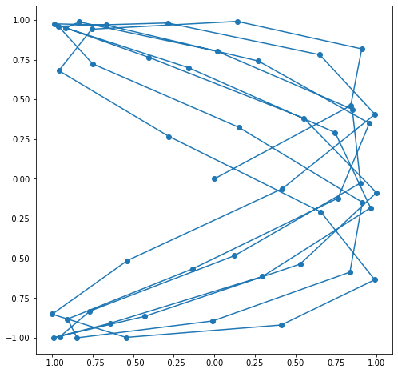

# NLP

<br>

<br>

## `Transformer`

* CNN, RNN 대신 Self-Attention을 사용하는 모델

> Transformer는 RNN, LSTM없이 time 시퀀스 역할을 하는 모델입니다. **RNN, LSTM 셀을 일체 사용하지 않았으나, 자체만으로 time 시퀀스 역할을 해줄 수 있는 굉장히 novel한 논문입니다.**
>
> 일반적인 Seq2Seq-Attention 모델에서의 번역 태스크의 문제는 원본 언어(Source Language), 번역된 언어(Target Language)간의 어느정도 대응 여부는 어텐션을 통해 찾을 수 있었으나, **각 자신의 언어만에 대해서는 관계를 나타낼수 없었습니다.** 예를 들면 `I love tiger but it is scare`와 `나는 호랑이를 좋아하지만 그것(호랑이)는 무섭다` 사이의 관계는 어텐션을 통해 매칭이 가능했지만 `it`**이 무엇을 나타내는지?**와 같은 문제는 기존 Encoder-Decoder 기반의 어텐션 메커니즘에서는 찾을 수 없었습니다.
>
> * 출처: [platfarm tech team](https://medium.com/platfarm/어텐션-메커니즘과-transfomer-self-attention-842498fd3225)


* 순서:

  1. Seq 처리: '`positional encoding`' (순서정보를 입력하면 저장되고 공식에 맞춰 벡터를 수치화 시키는 곳)
     * 상대적/절대적인 정보를 넣어야 함 <br>
  2. 그걸 (input) encoder의 attention으로 전달 <br>
  3. 2의 결과를 FNN을 전달(단순 linear prejection(차원축소) 위함) <br>
  4. 3의 결과를 Decoder의 attention으로 전달<br>
  5. (`fine Tuning`) input Decoder에서 입력한 순서 정보(positional encoding) 출력<br>
  6. 5의 결과를 attention으로 전달<br>
  7. 4의 결과와 합침<br>
  8. FNN으로 전달(linear, softmax 거침)<br>
  9. 그 결과물을 일부(?) 다시 1로 전달<br>

* `attention`: 입력된 값을 가중치로 조정하여 목적에 맞게 바꿔줌 

* `self attention`: Q와 transposed K를 내적한후 Scaled with Softmax 함으로써 Self-Attention 시킵니다.(attention score)

* `Masked`: Self-Attention시 자신의 time step 이후 word는 가려 Self-Attention 되는 것을 막는 역할. `np.triu`를 통해 한번 삼각형 행렬을 만들어 줍니다. 1이 Mask 역할.

  ```python
  '''
  # make mask like this.
  0 1 1
  0 0 1
  0 0 0
  '''
  
  def get_attn_subsequent_mask(seq):
    attn_shape = [seq.size(0), seq.size(1), seq.size(1)]
    subsequent_mask = np.triu(np.ones(attn_shape), k=1)
    subsequent_mask = torch.from_numpy(subsequent_mask).byte()
    return subsequent_mask
  ```

* `d_model` : 임베딩을 하기 위한 차원으로 보통 512를 사용. embedding vector table. <br>

* `attention value`: 수치화된 table에서 중요한 정보를 골라 가중치를 줄 수 있음<br>

<br><br>

### Encoder

| **`Positional Encoding`**                                    | **`Multi-Head Attention`**                                   | **`Scaled-Dot Product Attention`**                           |
| ------------------------------------------------------------ | ------------------------------------------------------------ | ------------------------------------------------------------ |
| <br /> | <br /> |  |
|                                                              |                                                              | 여기서 Mask(opt.) 부분은 <br />Decoder의 Masked MultiHead Attention과 <br />다른 Masking이고 Optional 한 부분. <br />단순히 아래와 같은 코드를 통해 <br />입력 dimension(=512) 중 word이 <br />아닌 경우를 구분하는 역할<br />(word 입력이 끝난 후 padding 처리와 동일) |

* `Encoder` 기능 설명

  | 이름                                                         | 기능                                                         | 설명                                                         | 매커니즘                                                     |
  | ------------------------------------------------------------ | ------------------------------------------------------------ | ------------------------------------------------------------ | ------------------------------------------------------------ |
  | **`Positional Encoding`** | 벡터로된 위치정보에다가 공식을 사용해서 **'서로 간격이 일정하도록&고르게 분포 하도록 반영**하면, 딥러닝이 이 정보를 분석해 어떤 pattern을 찾는다.<br />*서로 간격이 일정하도록 고르게 분포 : 모든 벡터가 거리 값이 같다.(아래 추가 설명 참고) | 문장은 일반적인 임베딩과 `Positional Encoding`을 <br />**더하여** Encoder의 Layer로 들어간다 |                                                              |
  | **`Multi-Head Attention`** | 1문장을 여러 head로 Self-Attention 시킴<br />                | ”Je suis étudiant”라는 문장의 임베딩 벡터가 512차원(`d_model`)이라면 8개 `head`로 나눠 64개의 벡터를 한 `Scaled Dot Attention`이 맡아 처리하는 것. <br />**이는 동일한 문장도 8명(8 heads)이 각각의 관점에서 보고 추후에 합치는 과정**이라고도 볼 수 있다.<br />*`d_model`은 임베딩을 하기 위한 차원으로 보통 512를 사용하고, `d_k`와 `d_v`는 64를 사용. <br /> | <br />동일한 [batch_size x len_q x d_model] shape의 동일한 `Q, K, V`를 만들어 [d_model, d_model] `linear`를 곱한 후, <br />**임베딩 차원을 8등분하여 `Scaled Dot Product Atttention`으로 넘겨준다.<br />**그리고 multi-head attention 그림에서의 h는 `n_heads`(number of head)를 나타내며 보통 8을 사용. 이는 64 * 8 = 512이기 때문. |
  | **`Scaled-Dot Product Attention`**  | `Self-Attention`이 일어나는 부분.<br />                      | - 한 `head`당 <br />(input 값) : Q(64), K(64), V(64)씩 가져가게 되는데, dimension(=512) 중 word가 아닌 경우를 구분하는 역할.<br />- 처음의 Q를 ResNet의 `Residual Shortcut`와 같은 컨셉으로 더해준다. 이는 층이 깊어지는 것을 더 잘 학습 시키기 위함 | <br />*`Self-Attention `>*<br />1. Q와 transposed K 사이를 내적하여 어텐션을 Softmax를 통해 구하고,<br/>2. 그 후에 V를 내적하여 중요한 부분(Attention)을 더 살린다.<br />3. 이렇게 8개의 head(여러 관점)으로 본 것을 다시 `concate`하고<br />4. `PoswiseFeedForwardNet`로 보냄 |
  | **`PoswiseFeedForwardNet`**                                  | 각 `head`가 만들어낸 `Self-Attention`을 치우치지 않게 **균등하게 섞는 역할** | FNN                                                          |                                                              |

  >  출처: [platfarm tech team](https://medium.com/platfarm/어텐션-메커니즘과-transfomer-self-attention-842498fd3225)

<br>

* 추가 설명

  * `positional encoding`:

    ```python
    PE = positional_encoding(50,5) # emb_size = dmodel = 2차원으로 표현 
    ```

    * > (5,6) 값을 변경해도 발산하지 않고 뱅글뱅글 돌면서 각 벡터들의 간격이 일정하게 유지된다.
      >
      > | positional_encoding(50,2)                                    | positional_encoding(50,5)                                    | positional_encoding(50,25)                                   | positional_encoding(50,5)                                    |
      > | ------------------------------------------------------------ | ------------------------------------------------------------ | ------------------------------------------------------------ | ------------------------------------------------------------ |
      > |  |  |  |  |

<br>

<br>

### Decoder

|                                                              | 설명                                                         |                                                              |
| ------------------------------------------------------------ | ------------------------------------------------------------ | ------------------------------------------------------------ |
| <br /> | 인코더와 동일하지만, `Self-Attention`시, <br />**`'Masked'-Multi-Head Attention`**을 쓴다는 점이 다르다.<br />* **Masked**를 쓰는 이유: Self-Attention시 자신의 time step 이후의 word는 가려서 Self-Attention 되는 것을 막는 역할. |                                                              |
|  | 노란색 Box에서 왼쪽 2개 화살표가 Encoder의 K,V 오른쪽 화살표가 Self-Attention을 거친 Decoder의 Q | <br />이렇게 나온 logistic을 일반적인Teacher Forcing을 통해 학습 |

> * 인용: [platfarm tech team](https://medium.com/platfarm/어텐션-메커니즘과-transfomer-self-attention-842498fd3225)

<br>

<br>

### Inference(추론)

| 전체 Inference                                               | Encoder Inference                                            |
| ------------------------------------------------------------ | ------------------------------------------------------------ |
| 일반적인 Seq2Seq 모델과 동일하게 Inference시 Encoder의 들어오는 문장(번역할 문장)은 정확히 알지만, Decoder에 들어오는 문장(번역되어지는 문장)은 알지 못한다. <br />시작 표시를 나타내는 \<S>를 사용해서 Seq2Seq와 동일하게 Inference 한다. | 이때 Encoder은 일반 학습시의 Encoder와 동일하고, Decoder만 순차적으로 진행하기 위해 Greedy Decoder 혹은 Beam Search를 사용.<br />inference word가 \<E> (end point)이면 inference를 멈춘다. |
|  |  |

> * 출처: [platfarm tech team](https://medium.com/platfarm/어텐션-메커니즘과-transfomer-self-attention-842498fd3225)

<br>

<br>

### Chatbot Code

* (2020-08-14) (data set)를 transformer 모델에 학습한 챗봇 만들기 미니 프로젝트

  Created by jynee & [molo6379](https://github.com/molo6379) & [hh](https://github.com/hayjee) & [Dabi](https://github.com/Jude0124) 

  [Zhao HG](https://github.com/CyberZHG/keras-transformer) keras transformer 코드 응용

  <br>

* 데이터 입력

```python
from keras_transformer import get_model, decode
import pickle
import warnings
warnings.filterwarnings('ignore', 'tensorflow')

# 단어 목록 dict를 읽어온다.
with open('./dataset/6-1.vocabulary.pickle', 'rb') as f:
    word2idx,  idx2word = pickle.load(f)
    
# 학습 데이터 : 인코딩, 디코딩 입력, 디코딩 출력을 읽어온다.
with open('./dataset/6-1.train_data.pickle', 'rb') as f:
    trainXE, trainXD, trainYD = pickle.load(f)
	
# 평가 데이터 : 인코딩, 디코딩 입력, 디코딩 출력을 만든다.
with open('./dataset/6-1.eval_data.pickle', 'rb') as f:
    testXE, testXD, testYD = pickle.load(f)
```

<br>

* model 빌드

```python
model = get_model(
    token_num=max(len(word2idx), len(word2idx)),
    embed_dim=32,
    encoder_num=2,
    decoder_num=2,
    head_num=4,
    hidden_dim=128,
    dropout_rate=0.05,
    use_same_embed=False,  # Use different embeddings for different languages
)
model.compile('adam', 'sparse_categorical_crossentropy')
```

<br>

* model load or fit(학습)

```python
LOAD_MODEL = True
if LOAD_MODEL:
    MODEL_PATH = './dataset/transformer.h5'
    model.load_weights(MODEL_PATH)
    
else:
    model.fit(
    x=[trainXE, trainXD],
    y=trainYD,
    epochs=1,
    batch_size=32)
    model.save_weights(MODEL_PATH)
```

<br>

* predict 함수 정의

```python
def ivec_to_word(q_idx):
    decoded = decode(
        model,
        q_idx,
        start_token=word2idx['<START>'],
        end_token=word2idx['<END>'],
        pad_token=word2idx['<PADDING>'],
    )
    decoded = ' '.join(map(lambda x: idx2word[x], decoded[1:-1]))
    return decoded
```

<br>

* chatbot 

```python
MAX_SEQUENCE_LEN = 10
def chatting(n=100):
    for i in range(n):
        question = input('Q: ')
        
        if  question == 'quit':
            break
        
        q_idx = []
        for x in question.split(' '):
            if x in word2idx:
                q_idx.append(word2idx[x])
            else:
                q_idx.append(word2idx['<UNKNOWN>'])   # out-of-vocabulary (OOV)
        
        # <PADDING>을 삽입한다.
        if len(q_idx) < MAX_SEQUENCE_LEN:
            q_idx.extend([word2idx['<PADDING>']] * (MAX_SEQUENCE_LEN - len(q_idx)))
        else:
            q_idx = q_idx[0:MAX_SEQUENCE_LEN]
        
        answer = ivec_to_word(q_idx)
        print('A: ', answer)

chatting(100)
```

<br>

<br>

<br>

<br>

## units of words

* 등장 배경:

  * FastText를 사용한다면,

    * n-gram character 방식<br>

      *단점 >*

      * word2vec의 oov 문제를 해결하지만, **collision 문제 발생**<br>

  * hash 사용한다면, hash-table 크기를 작게 잡으면 collision 발생

    > 참고: DB에서는,
    >
    > 1. Collision 문제를 해결하기 위해서 **별도의 overflow page를 사용**한다
    >
    > 2. overflow page가 늘어나면 검색 속도가 떨어진다
    >
    > 3. overflow paee가 임계치를 초과하면 **hash-table을 늘려서** DB를 재구성
    >
    >    => "Reorganization" 따라서 기존의 **단어들의 위치가 변경**된다.
    >
    >    * NLP 분석 시엔 Reorganization하면 단어들의 위치가 변경되므로 다시 학습시켜야 한다. 따라서 근본적인 해결책이 되진 못한다.<br>

    <br>

* `Word Piece(WPM)`, **`Sentence Piece(SPM)`**

  * NLP에서 Sub-word 구축할 때 사용

  * 형태소 분석과 달리 언어의 특성에 구애 받지 않아 아무 언어나(한글/영어 등) 사용이 가능하다.

  * 빈도가 높은 문자열들은 하나의 `unit`으로 취급하여 사전에 등록해 사용한다.

    * 'unit': 의미를 가진 문자는 아니고 음절이라기엔 두 음절을 하나로 보니 unit이란 이름을 사용한다.

  * > 구글은 자신들의 구글 번역기에서 WPM이 어떻게 수행되는지에 대해서 기술했다.
    >
    > ```python
    > WPM을 수행하기 이전의 문장:
    > Jet makers feud over seat width with big orders at stake
    > WPM을 수행한 결과(wordpieces) :
    > _J et _makers _fe ud _over _seat _width _with _big _orders _at _stake
    > ```
    >
    > Jet는 J와 et로 나누어졌으며, feud는 fe와 ud로 나누어진 것을 볼 수 있다. WPM은 입력 문장에서 기존에 존재하던 띄어쓰기는 언더바로 치환하고, 단어는 내부단어(subword)로 통계에 기반하여 띄어쓰기로 분리한다.
    >
    > 기존의 띄어쓰기를 언더바로 치환하는 이유는 **차후 다시 문장 복원을 위한 장치**이다. WPM의 결과로 나온 문장을 보면, 기존에 없던 띄어쓰기가 추가되어 내부 단어(subwords)들을 구분하는 구분자 역할을 하고 있으므로 본래의 띄어쓰기를 언더바로 치환해놓지 않으면, 기존 문장으로 복원할 수가 없다.
    >
    > WPM이 수행된 결과로부터 다시 수행 전의 결과로 돌리는 방법은 현재 있는 띄어쓰기를 전부 삭제하여 내부 단어들을 다시 하나의 단어로 연결시키고, 언더바를 다시 띄어쓰기로 바꾸면 된다.
    >
    > * 출처: [정민수][https://medium.com/@omicro03/%EC%9E%90%EC%97%B0%EC%96%B4%EC%B2%98%EB%A6%AC-nlp-5%EC%9D%BC%EC%B0%A8-%EB%8B%A8%EC%96%B4-%EB%B6%84%EB%A6%AC-60b59f681eb7]

  * pre-trained 된 [SKTBrain의 KoBert](https://github.com/SKTBrain/KoBERT)를  fine tuning으로 사용하면 쉽게 SentencePiece를 만들 수 있다.

  <br>

  * WPM, SPM

    * SPM은 GOOGLE이 C++로 만들어서 속도가 빠르다.

    * (단점) 조사도 쪼개서 보기 때문에 챗봇 만들 때 답변으로 잘못된 조사가 붙여 나올 수 있다.

      * ex: 번역 api 사용 시 부자연스러운 조사
      * 개선 방법: (1) 데이터 양을 늘린다. (2) BERT를 사용한다.

      > [나는 학교에 간다]
      >
      > 1. 단어와 단어를 구분하는 단어의 띄어쓰기에만 언더바 붙이기 "나는\_학교에_간다"
      > 2. '_학교' → 사전에 등록
      > 3. '_나' → 사전에 등록
      > 4. '는' → 사전에 등록
      > 5. '간다' → 사전에 등록
      > 6. ['\_학교', '_나', '는', '간다']
      > 7. [5, 4, 61,12]

  <br>

* `BPE`

  * 데이터 압축기술.

    > 구글의 WPM에는 BPE(Byte Pair Encoding) 알고리즘이 사용되었다.
    >
    > BPE 알고리즘의 기본 원리는 가장 많이 등장한 문자열에 대하여 병합하는 작업을 반복하는 데, 원하는 단어 집합의 크기. 즉, 단어의 갯수가 될 때까지 이 작업을 반복한다.
    >
    > * 출처: [정민수][https://medium.com/@omicro03/%EC%9E%90%EC%97%B0%EC%96%B4%EC%B2%98%EB%A6%AC-nlp-5%EC%9D%BC%EC%B0%A8-%EB%8B%A8%EC%96%B4-%EB%B6%84%EB%A6%AC-60b59f681eb7]

    <br>

    >  예> 
    >
    >  [abcabtabsta]
    >
    >  1. 'ab' → 사전에 등록
    >  2. 'abc' → 사전에 등록
    >  3. 'r' → 사전에 등록
    >  4. 't' → 사전에 등록
    >  5. 'u' → 사전에 등록

<br>

<br><br>

<br>

* 참고:

  > * 아마추어 퀀트, blog.naver.com/chunjein
  >
  > * platfarm tech team. 2019.05.11. "어텐션 메커니즘과 transfomer(self-attention)". https://medium.com/platfarm/어텐션-메커니즘과-transfomer-self-attention-842498fd3225
  > * Zhao HG. "keras-bert". https://github.com/CyberZHG/keras-bert
  > * 정민수. 2019.06.07. "자연어처리(NLP) 5일차 (단어 분리)". https://medium.com/@omicro03/%EC%9E%90%EC%97%B0%EC%96%B4%EC%B2%98%EB%A6%AC-nlp-5%EC%9D%BC%EC%B0%A8-%EB%8B%A8%EC%96%B4-%EB%B6%84%EB%A6%AC-60b59f681eb7. @omicro03