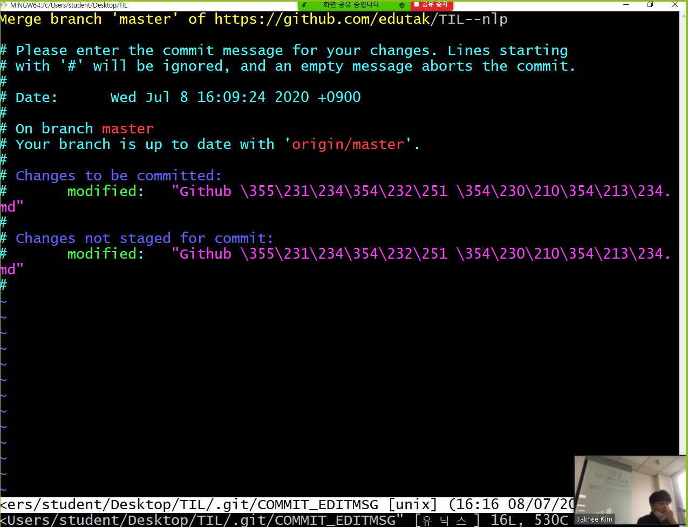

# Git

> Git은 분산형 버전 관리 시스템(DVCS) 중 하나이다.


## 0. Git 기초 설정

* windows 환경에서는 `git for windows`로 검색하여 `git bash`를 설치한다. [다운로드 링크](https://gitforwindows/org/)

* 최초에 컴퓨터에서 git을 사용하는 경우 아래의 설정을 진행한다.

  ```bash
  $ git config --global user.email 이메일 주소
  $ git config --global user.name 유저 네임
  # 확인
  $ git config --global -l
  ```

  * 이메일 주소를 설정할 때, github에 가입된 이메일로 설정을 해야 커밋 이력이 github에 기록된다. 


## 1. Git을 통한 버전관리 기본 흐름

### 1.1. Git 저장소 초기화

> 특정 폴더를 git 저장소로 활용하기 위해서 최초에 입력하는 명령어

```bash
$ git init
Initialized empty Git repository in C:/Users/jynee/Desktop/TIL/.git/
(master) $
```

* .git 폴더가 숨긴 폴더로 생성되며, git bash에서는 `(master)` 라고 표기된다.

* 반드시 git으로 활용되고 있는 폴더 아래에서 저장소를 선언하지 말자!

* 잘못 저장했으면 .git 폴더 삭제!

  

### 1.2. add

> 커밋 대상 파일들을 추가한다.


add 전 상황

``` bash
$ git status
On branch master
# 커밋 없음

No commits yet
# 트랙킹 되지 않는 파일들
# => 새로 생성된 파일이고, git으로 관리 중이지 않는 파일

Untracked files:
	# git add 파일
	# 커밋이 될 것들을 포함시키기 위해서 위의 명령어를 써라! 
  (use "git add <file>..." to include in what will be committed)
        git.md
        markdown-images/
        markdown.md

nothing added to commit but untracked files present (use "git add" to track)

```


``` bash
$ git add .
$ git status
On branch master

No commits yet
# 커밋될 변경사항들 
Changes to be committed:
  (use "git rm --cached <file>..." to unstage)
        new file:   git.md
        new file:   "markdown-images/\354\235\264\353\257\270\354\247\200 027.png"
        new file:   markdown.md

```


* add 명령어는 아래와 같이 활용된다.

  ``` bash
  $ git add . # 현재 디렉토리 전부
  $ git add git.md # 특정 파일
  $ git add markdown-images/ # 특정 디렉토리
  ```


### 1.3. `commit`

> 이력을 확정 짓는 명령어


```bash
$ git commit -m '커밋 메시지' #$ git commit -m 'Init'
[master (root-commit) 4f243d5] Init
 3 files changed, 177 insertions(+)
 create mode 100644 git.md
 create mode 100644 "markdown-images/\354\235\264\353\257\270\354\247\200 027.png"
 create mode 100644 markdown.md
 
$ git status
On branch master
nothing to commit, working tree clean
```


#### `log` 명령어

> 커밋 내역들을 확인할 수 있는 명령어

```bash
$ git log
commit 4f243d5f4ad16abb6a5a3b713e840229c7122c02 (HEAD -> master)
Author: jynee <y.jynee@gmail.com>
Date:   Wed Jul 8 14:41:26 2020 +0900

    Init

# 최근 n개 이력(1개)
$ git log -1
commit 4f243d5f4ad16abb6a5a3b713e840229c7122c02 (HEAD -> master)
Author: jynee <y.jynee@gmail.com>
Date:   Wed Jul 8 14:41:26 2020 +0900

# 간략한 표현
$ git log --oneline
4f243d5 (HEAD -> master) Init

# 최근 n개 이력을 간략하게
$ git log --oneline -1
4f243d5 (HEAD -> master) Init

```


## 2. 원격 저장소 활용

> 원격 저장소(remote repository)를 제공하는 서비스는 많다. (ex: gitlab, bitbucket)
>
> 그 중에서 github을 기준으로 설명하겠다.

### 2.1. 원격 저장소 등록

> git 아! 원격저장소(remote)로 등록해줘(add) origin 이라는 이름으로 url을! 

```bash
$ git remote add origin 저장소 url # 최초 1회 연결 작업 후 push로만 진행
```

* 저장소 확인

  ```bash
  $ git remote -v
  origin  https://github.com/jynee/TIL.git (fetch)
  origin  https://github.com/jynee/TIL.git (push)
  ```


* 저장소 삭제

  origin으로 저장된 저장소를 rm(remove)한다. 

  ```bash
  $ git remote rm origin
  ```


### 2.2. push(github업로드)

origin으로 설정된 원격저장소의 master 브랜치로 push 한다.

```bash
$ git push origin master
```


### 2.3. `clone`

> 원격 저장소를 복제 해온다.

```bash
~/집 $ git clone https://github.com/edutak/TIL--nlp.git
~/집 $ cd TIL--nlp
~/집/TIL--nlp (master) $
```

* 복제 하는 경우 원격저장소 이름의 폴더가 생성된다.
* 해당 폴더로 이동하여 활용을 하면 된다.
* 이후 작업을 하는 경우 `add`, `commit`, `push`
* Clone = init

### 2.4. `pull` 

> 원격 저장소의 변경사항을 받아온다.

```bash
~/Desktop/TIL (master) $ git pull origin master
remote: Enumerating objects: 4, done.
remote: Counting objects: 100% (4/4), done.
remote: Compressing objects: 100% (3/3), done.
remote: Total 3 (delta 0), reused 3 (delta 0), pack-reused 0
Unpacking objects: 100% (3/3), 563 bytes | 5.00 KiB/s, done.
From https://github.com/edutak/TIL--nlp
 * branch            master     -> FETCH_HEAD
   b523707..187ed91  master     -> origin/master
Updating b523707..187ed91
Fast-forward
 ...hub \355\231\234\354\232\251 \354\230\210\354\213\234.md" | 12 ++++++++++++
 1 file changed, 12 insertions(+)
 create mode 100644 "Github \355\231\234\354\232\251 \354\230\210\354\213\234.md"
```

* push ~ pull


git status

git add .

git commit - m 'Add README'

git push origin master


* 모든 변경사항은 local 하고 add-commit 해야 하는데 github web에서 했을 때 error check

  > 원격 저장소와 로컬 저장소의 이력이 다르게 구성되는 경우 
  >
  > 1) Github에서 직접 파일 수정을 하거나, 
  >
  > 2) 협업하는 과정이거나, 
  >
  > 3) 집-강의장 환경으로 왔다갔다 하는 상황에서 발생할 수 있는 오류

  * git log --oneline #오류 확인

  

* 이때, 원격 저장소 커밋 목록들과 로컬 저장소의 `git log --oneline` 으로 비교 해보면 다른 점이 반드시 있을 것이다.

  * git pull origin mater
  
  
  
* 해결 방법은 다음과 같다. 

  1) 원격 저장소 내용을 받아온다.

  ```bash
  $ git pull origin master
  remote: Enumerating objects: 5, done.
  remote: Counting objects: 100% (5/5), done.
  remote: Compressing objects: 100% (3/3), done.
  remote: Total 3 (delta 2), reused 0 (delta 0), pack-reud 0
  Unpacking objects: 100% (3/3), 704 bytes | 7.00 KiB/s, ne.
  From https://github.com/edutak/TIL--nlp
   * branch            master     -> FETCH_HEAD
     173cf24..68ec3f5  master     -> origin/master
  Merge made by the 'recursive' strategy.
   "Github \355\231\234\354\232\251 \354\230\210\354\213\
   1 file changed, 1 insertion(+)
  
  ```

  * 이때 Vim 편집기 화면이 뜨는데, 커밋 메시지를 작성할 수 있는 곳이다.
    * `esc` 를 누르고, `:wq` 를 순서대로 입력한다.




​		2) 다시 push를 한다.

```bash
$ git log --oneline
c30820c (HEAD -> master) Merge branch 'master' of https://github.com/edutak/TIL--nlp
e151783 Add README
68ec3f5 Update Github 활용 예시.md
173cf24 Update files
187ed91 Add clone command at home
b523707 Update git.md
6b6d274 Init
$ git push origin master
```


## 3. 정적 파일 생성기(블로그 생성기)

> md 바탕으로 html 생성

* Jekyll(지킬):

  * 예전부터 많이 쓰임
  * ruby

  

* Gatsby:
  * 최근에 많이 쓰임(트렌디함)
  * Js, React, Graphql


* 참고: startbootstrap.com/thems/resume/


## 4. 알고리즘 공부


* swea

* 백준

* 프로그래머스

  